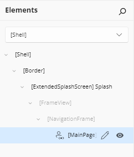
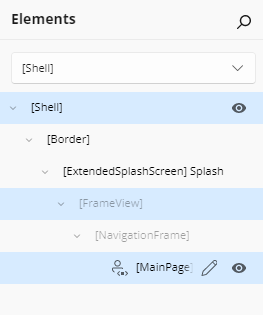
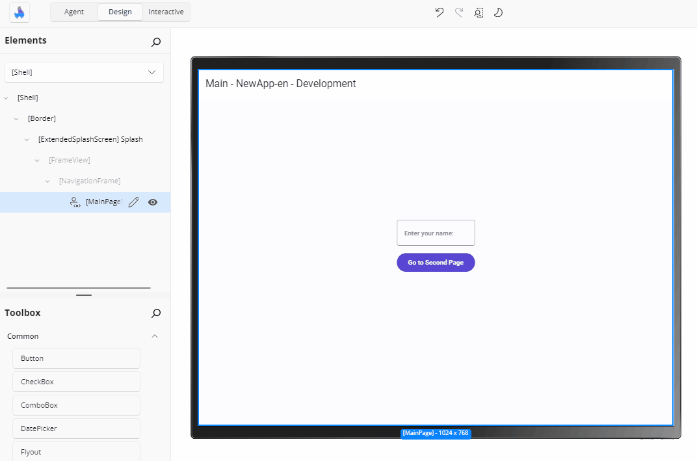
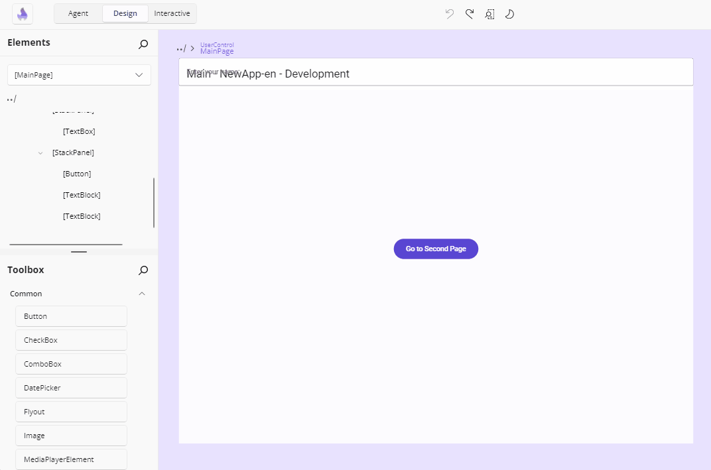
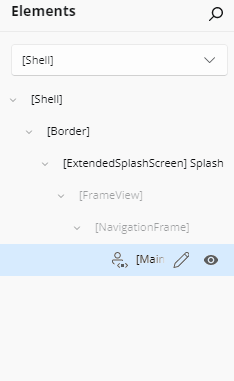
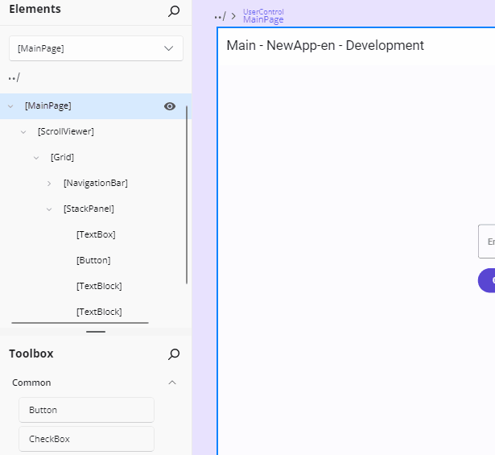
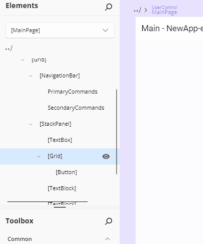
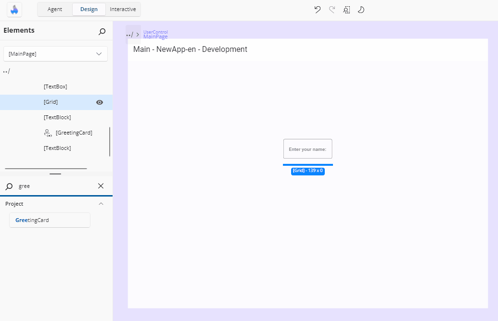
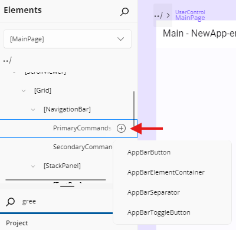

# Elements

The **Elements** panel gives you a hierarchical view of your app's user interface. It reflects the XAML visual tree and shows how controls are nested and organized on the current page. You can use it to select elements, change layout structure, wrap items in containers, or quickly jump between components, making it easier to manage complex UIs during live design.

Whether you're organizing layout containers, editing a UserControl, or deleting an unused element, the Elements panel gives you precise control over your app's structure.

## Reading the Tree

The tree is rooted at the element you are currently designing, and that root node is expanded by default. Each element authored in XAML appears as a node labelled with its type — `[Button]` — and an element with an `x:Name` includes the name: `[Button] MyButton`.

Not everything in the running visual tree is shown, and that is deliberate: the panel shows what you can edit, not the framework's internal plumbing.

- Children set through a panel's XAML content property appear **directly** under the panel, with no intermediate node for the content property.
- A **non-content collection property** that holds child elements — a `NavigationBar`'s `SecondaryCommands`, say — appears as a **property node** named after the property, with its children beneath it.
- Runtime-generated content is not listed: an `ItemsControl` filled from an `ItemsSource` binding shows no `Items` node, and no generated item containers appear. Runtime-only state such as `SelectedItems` is never shown either.
- An `ItemsControl` whose `Items` are declared in XAML as non-element objects (for example `<x:String>` entries) keeps its **Items** property node.
- A nested `UserControl` defined in its own XAML file appears as a **single node** with a `UserControl` icon; its contents are not listed. Enter its editing scope to see and edit inside it.

Two visual markers are worth knowing:

- A **yellow dot** on a row means that element carries design-time placeholder values; its tooltip explains that those values need replacing with real data.
- Nodes that belong to a **data template** are rendered in the template accent color.

The tree keeps itself current: it refreshes when your app navigates to a different page, when late-loading elements finish loading, and after an edit — and nodes representing the same elements keep their expansion and selection state across a refresh. When your app unloads, the tree, selection, and search state are cleared and rebuilt for the next app that connects.

## Select Elements in the Visual Tree

Click an element in the visual tree to select it. The selected element also highlights in the **Canvas** so you can see where it is, and the **Properties** panel is populated for it.

Selecting on the canvas works the other way round too: the matching tree node is highlighted, its ancestors are expanded as needed, and the tree scrolls so it is visible. Re-selecting an element that is already selected does not re-scroll the tree.

Clicking a node that has no XAML source — an empty template root placeholder, for example — shows a **XAML is missing for this element** hint and leaves the selection unchanged.

### Select Multiple Elements

Hold `Ctrl` (or `Cmd` on macOS) and click multiple items to select them together. This is helpful when applying the same property changes to multiple elements. `Ctrl` + clicking an already-selected node removes it from the selection.

### Read-Only Nodes

Some nodes are **dimmed**. You can still select them to inspect their runtime property values, but nothing about them can be edited — there is no XAML in the file you are designing to change:

| Node | Why it is read-only |
| --- | --- |
| A page loaded into a navigation frame | Its XAML lives in its own file |
| An element created in code with no XAML source | There is no XAML to edit |
| A code-behind root (for example a `Frame` created in `App.xaml.cs`) | Same |

Selecting a code-behind infrastructure element is safe: it is selected and adorned on the canvas, with no error and no app reload. A XAML-authored element nested *inside* a code-behind container keeps its own identity and remains selectable in its own right.

The **scope root** — the page or `UserControl` you entered — is not dimmed, and selecting it gives you a fully editable **Properties** panel.

## Rearrange Elements with Drag and Drop

To move an element:

1. Click and drag it within the visual tree in the **Elements** panel.
2. Drop it where you want it, either within the same parent or under a different one.

You can:

- Reorder elements within the same container

  

- Move an element to a new parent, such as placing a `Button` inside another `StackPanel`

  

Insertion adorners show where the element would land — before, after, or as a child — and the drag caption reads **Move**. What a target accepts depends on what it is:

- A container that accepts a **single child** (an empty `Border`, say) accepts a drop only while it is empty.
- A container that accepts **multiple children** (a `StackPanel`) accepts drops as children or between existing children.
- An element that accepts **no children** (a `TextBlock`) accepts drops only before or after it, into its parent.
- A **property node** accepts a drop only when every dragged element's type is supported by that property.

Drops are rejected when the target is the dragged element itself, when it is a descendant of the dragged element, when the drop would put the element straight back where it already is, or when the target element or property is read-only. The tree root cannot be dragged, and when several nodes are selected only the one you drag is moved.

Dragging from the [Toolbox](xref:Uno.HotDesign.Toolbox) uses the same adorners with an **Add \<item name>** caption, and a toolbox template that applies to existing elements shows **Apply \<item name>** and is only accepted on compatible types.

## Expand and Collapse Containers

Panel elements like `Grid`, `Border`, and `StackPanel` can contain child elements. In the visual tree, these appear as expandable nodes having multiple children.

Content controls like `Border` or `Viewbox` can have only one child.

Use the arrow next to a node to collapse or expand it. This helps reduce visual clutter and focus on the part you're actively editing.

## Search and Filter

Type in the panel's search box to filter the tree. Nodes whose label contains the text (case-insensitive) stay visible, the matching part of each label is highlighted, and ancestors of matches stay visible and are expanded. Everything else is hidden.

If nothing matches, the tree is replaced by a **No matching results found.** message. Emptying the search box restores every node and removes the highlights.

## Scrolling a Deep Tree

Deeply nested rows can be wider than the panel. When a row's indentation plus its label exceeds the visible width, a horizontal scrollbar becomes available so you can bring the cropped part of the row into view — and no scrollbar is shown when the content genuinely fits. Vertical scrolling works as you would expect.

A row's action buttons stay aligned with the row's currently visible right edge as you scroll horizontally, so they never drift out of reach.

## Row Action Buttons

Hovering a row — or selecting it — shows its action buttons at the right edge:

- **+** on a property node that accepts multiple children opens a flyout listing the element types that can be added; picking one inserts a new element of that type into the collection.
- The **eye** button toggles that element's visibility in the running app, and its icon reflects the collapsed/visible state.
- The **pencil** button on a `UserControl` node enters that control's editing scope.

<!-- TODO(image): Screenshot of an Elements tree row hovered, with its action buttons called out: the "+" add-to-collection button on a property node, the eye visibility toggle, and the pencil Edit UserControl button. -->

## Wrap an Element with a New Parent

To nest an element inside a new container:

1. Right-click the element.
2. Choose **Add parent**.
3. Select a layout control from the list: `Border`, `Canvas`, `Grid`, `RelativePanel`, `ScrollViewer`, `StackPanel`, or `Viewbox`.

This places the selected element inside the new parent and updates the visual tree accordingly.

## Jump to an Element's Parent

To quickly select an element's parent:

1. Right-click the child element.
2. Choose **Select parent** — its shortcut, `Shift + Enter`, is shown in the menu.

This selects the parent in both the **Elements** panel and the **Canvas**, helping you navigate complex trees.

## Delete an Element from the Visual Tree

To remove an element:

1. Right-click it.
2. Choose **Delete [ElementName]** (e.g., **Delete Button**) — its shortcut, `Delete`, is shown in the menu.

The element is immediately removed from the layout and visual tree.

## The Context Menu

Right-clicking an element node with a parent opens its context menu. The tree root, property nodes, and the expand/collapse chevron show no menu.

Depending on the element, the menu offers:

| Entry | Shortcut | What it does |
| --- | --- | --- |
| **Delete \<element>** | `Delete` | Removes the element from the XAML and the tree |
| **Add parent** | — | Wraps the element in `Border`, `Canvas`, `Grid`, `RelativePanel`, `ScrollViewer`, `StackPanel`, or `Viewbox` |
| **Select parent** | `Shift + Enter` | Makes the parent the current selection |
| **Edit \[\<template property>]** | — | Opens the [Template Editor](xref:Uno.HotDesign.Properties.TemplateEditor) for the template the element belongs to |
| **Edit \<name>** | `Ctrl + Shift + U` | Enters the `UserControl`'s editing scope |
| **Apply template** | — | Lists the template snippets matching the element's type (when snippets are enabled) |

An element whose XAML cannot be edited gets a reduced menu, with the editing entries omitted.

## Edit a UserControl from the Visual Tree

A `UserControl` is a reusable part of your app that groups UI elements and their behaviors. It is commonly used to organize parts of your interface into self-contained, maintainable units that can be reused across different parts of your application.

If your page includes a `UserControl`, you can edit it directly by:

- Clicking the pencil icon next to the `UserControl` in the visual tree.
- Double-clicking the node.
- Or, right-clicking the node and choosing **Edit [UserControlName]**.

This opens the editor for the `UserControl`, allowing you to modify its internal structure or layout. To return to your previous page edition, click the `../` back icon in the top-left corner of the interface or the **Elements** panel.

## Collection Property Nodes

Controls that expose child elements through a named collection property show that property as its own node — and you can add to it from the tree. The `NavigationBar` control is the clearest example, with two such collections:

- **PrimaryCommands**
- **SecondaryCommands**

### Hover & Add

1. **Hover** over either `PrimaryCommands` or `SecondaryCommands` in the tree and a **+** icon appears.

2. **Click the +** to open a lite, dismissible flyout listing all compatible element types (e.g. `AppBarButton`, `AppBarSeparator`, `AppBarToggleButton`):

   

3. **Select** a type to insert it at the end of the collection.

> **Tip**: if your collection already contains many items, the flyout will show a "Too many items" tip prompting you to drag from the Toolbox instead of scrolling through a very long list.

### Reorder & Remove

- **Reorder** by dragging the item up or down.

- **Remove** by selecting one or more command nodes and pressing **Delete**, or by right-clicking and choosing **Delete**.

### Incompatible Drag-and-Drop

If you attempt to drag an element that isn't valid for the collection (for example a `TextBlock` into a `NavigationBar` command collection), you'll see a "no-drop" cursor and a teaching tip explaining why.

## Template Roots

Inside a template editor, the template itself appears as a **template root** node:

- For a regular template property, its label is `[OwnerType].PropertyName` — for example `[ListView].ItemTemplate`.
- For a branch of a template selector, its label is the compound key as-is, for example `ItemTemplateSelector.TemplateB`.

Template roots are containers, not selections: clicking one selects nothing, because its children are the editable elements. An **empty** template root accepts only toolbox items, as its single child — moving an existing element onto it is rejected.

In the **Scope Selector** tree, by contrast, a data template node *is* navigable: picking it enters that template's editing scope. Where a template property is a template selector, a node for the selector property groups its individual template branches beneath it.

## Keyboard Interaction

Arrow keys and `Tab` navigate the tree, and focus skips nodes that cannot be selected. The context menu advertises the shortcuts for its entries: `Delete`, `Shift + Enter` for **Select parent**, and `Ctrl + Shift + U` for **Edit \<UserControl>**.

While the Elements panel is covered by the disabled overlay — with **Interactive** mode on, for example — the tree cannot be reached by `Tab`, and arrow keys, selection, and commands have no effect. The existing selection stays visible but cannot be changed until interactivity is restored.

## Navigate Scopes with Scope Selector

At the top of the **Elements** panel, you'll find the **Scope Selector**. This powerful feature lets you zoom into **UserControls** and **DataTemplates** for focused, isolated editing of nested UI contexts.

When you have complex nested structures like custom DataTemplates in ListBoxes or multi-level UserControl hierarchies, the Scope Selector helps you:

- **Zoom into a specific scope** to edit only that context without affecting parent layouts
- **Navigate the scope tree** to quickly switch between templates, UserControls, and the main application
- **Keep designs focused** by reducing visual clutter and preventing accidental changes to parent elements

  

**Example Workflow**: If your page contains a ListBox with a custom DataTemplate:

1. Your **Elements** panel shows the page hierarchy
2. Click the **Scope Selector** to open the scope tree
3. Navigate to the **ItemTemplate** scope
4. Edit the template content (buttons, text, icons) in isolation
5. Return to **Application Scope** to adjust the ListBox properties

[➜ Learn more about the Scope Selector](xref:Uno.HotDesign.ScopeSelector)

## Next Step

- [Interactive Canvas](xref:Uno.HotDesign.Canvas)
