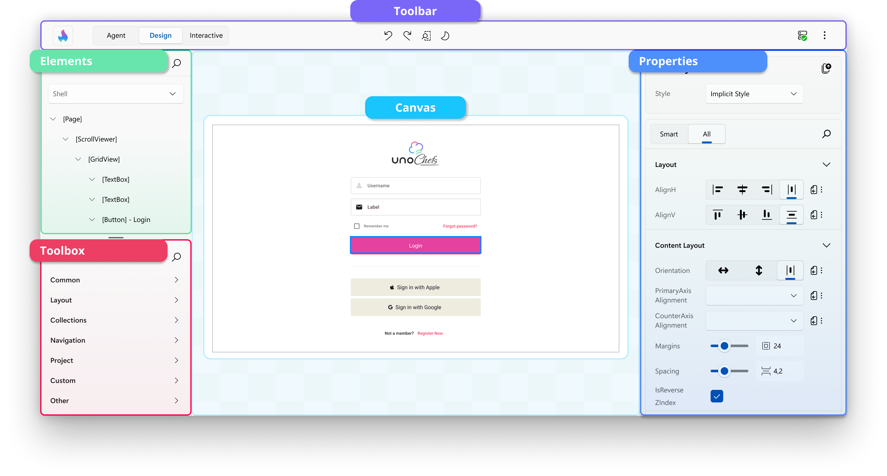
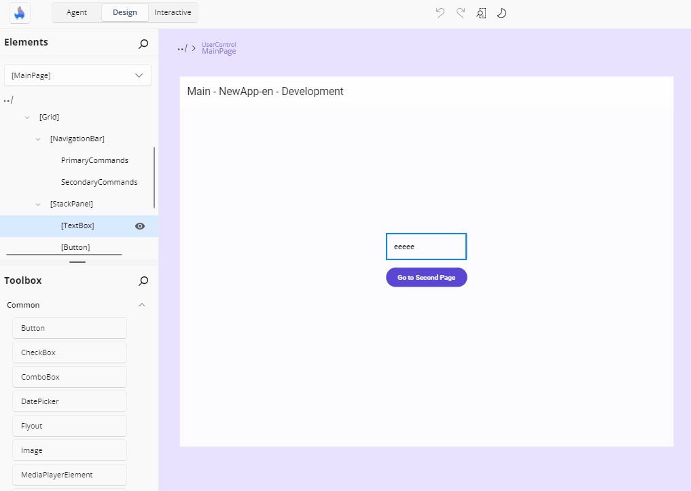

# Getting Started with Hot Design®

**Hot Design®** is the next-generation runtime Visual Designer for cross-platform .NET applications, transforming your live, running app into a real-time Designer.

This guide provides the steps to set up Hot Design and introduces its key features and visual design capabilities, helping you start creating and refining user interfaces efficiently and intuitively.

**Hot Design** is part of **Uno Platform Studio**, an AI-native productivity suite for building enterprise-grade, cross-platform .NET applications. With **Uno Platform Studio 3.0**, Hot Design works alongside two new AI-native components:

- **Uno Platform Studio App** — go from a prompt to a working, cross-platform app in minutes, then continue building in your IDE.
- **Uno Platform Studio Agent** — an orchestration layer that brings deep, cross-platform .NET domain knowledge and 70+ Uno Platform-specific skills to AI models, delivered through the `uno-platform-studio` plugin for Claude Code, GitHub Copilot, and OpenAI Codex.

[➜ Learn more about Uno Platform Studio](xref:Uno.Platform.Studio.Overview)

## Set Up Your Environment for Hot Design

[!include[hd-important-info](includes/hd-important-info.md)]

> [!IMPORTANT]
> If you're new to developing with Uno Platform, make sure to set up your environment by [following our getting started guide](xref:Uno.GetStarted).

To start using **Hot Design**, ensure you are signed in with your Uno Platform account. Follow [these instructions](xref:Uno.GetStarted.Licensing) to register, activate your license, and sign in.

### Upgrading Existing Applications

Hot Design requires **Uno.Sdk 6.0 or later** (we recommend our newer versions to get the most out of the latest Hot Design features), so you’ll need to update your project to the [latest **Uno.Sdk** version](https://www.nuget.org/packages/Uno.Sdk). For detailed steps, see our [migration guide](xref:Uno.Development.MigratingFromPreviousReleases).

If you’re coming from **Uno.Sdk 5.4 or lower**, note that `EnableHotReload()` in *App.xaml.cs* has been deprecated. Replace it with `UseStudio()` to keep Hot Reload working.

Once you've updated your project and **[signed in with your Uno Platform account](xref:Uno.GetStarted.Licensing)**, you can access **Hot Design** by clicking the **flame** icon in the diagnostics overlay that appears over your app.

  

### Hot Design Status on the Entry Button

The flame icon carries a badge that tells you whether Hot Design can be entered, and why not when it can't:

| State | Icon |
| --- | --- |
| Initializing | Flame with a gray badge containing three dots |
| Ready (licensed) | Solid flame in the theme color |
| Trial period | Flame with a badge containing an exclamation mark |
| Trial expired / unlicensed / signed out | Flame with a blue badge |
| Connection error | Grayed flame with a red badge — the button also collapses |
| Hot Design active | The **Exit Hot Design Mode** icon |

Hovering shows **Activate Hot Design**, **Trial: X days left - Activate Hot Design**, or **Exit Hot Design** while active.

The button is **hidden** while the system cannot be used at all — while the dev server connection or the license response is still pending, when the dev server is not running, or when your app was not built from the IDE. It **is** shown for license states you can act on: clicking it then explains the situation with a sign-in or get-license action instead of entering. A trial with five or fewer days remaining still enters, with a warning about the days left.

> [!NOTE]
> Hot Design also needs the Hot Reload engine to be ready. Until it first becomes ready, the status stays *Initializing*; once it has, that readiness is latched, so ordinary background reloads do not push the status back.
>
> An application targeting a framework older than **.NET 9** cannot enter Hot Design, and a message explains that .NET 9 or later is required.

### What Happens the First Time

On your very first Hot Design session:

- Hot Design **activates automatically** once the connection and license response arrive and the status is usable, and shows the introduction overlay. (It also resumes automatically on later runs if it was active when your app last closed. You can force or suppress this with the launch-on-start option — set via API parameter, MSBuild property, or environment variable, where the environment variable wins, then the MSBuild property, then the API parameter.)
- Your app window is **maximized** to give the tools room, and the size and state it had beforehand are remembered so they can be restored when you exit.
- An **introduction overlay** presents three slides — *Welcome to Hot Design*, *Design Mode*, and *Interactive Mode*. Dismissing it (or exiting Hot Design from it) prevents it from showing again.
- The **innermost page** in your visual tree is opened for editing automatically, so you can start editing without double-clicking the page in the hierarchy.

On later activations the window restores to the size and maximized state of your last Hot Design session, and returns to its pre-Hot Design size and state when you exit.

### Choosing Your Tool Layout

After dismissing the intro, you can choose how to organize **Hot Design** tools:

- **Fixed In-App Toolbar** (default) — Tools appear at the top of your running app window
- **External Tool Window** — Tools open in a separate window, giving you more app canvas space

To switch between these layouts, click the **More** menu (three dots) in the toolbar and toggle **Windows** > **Show Tools In-App**.

[➜ Learn more about toolbar options and external window](xref:Uno.HotDesign.ToolbarExternalWindow)

## Hot Design® Core Tool Panels

Once in Hot Design, your running app becomes an interactive canvas.
Hot Design offers an intuitive interface for designing and interacting with your app. This enables you to seamlessly create, edit, and refine your app's user interface in real-time, streamlining the design process for maximum efficiency and simplicity.

Here are the tool panels available on the interactive canvas:

### Toolbox

On the upper-left side, the **[Toolbox](xref:Uno.HotDesign.Toolbox)** panel provides a categorized list of available controls you can use in your application, including custom and third-party UI controls. It features a search bar for quickly finding specific controls, which you can drag and drop directly onto the canvas or the **[Elements](xref:Uno.HotDesign.Elements)** panel for easy integration into your design.

[➜ Learn more about the Toolbox panel](xref:Uno.HotDesign.Toolbox)

### Elements

Below the **[Toolbox](xref:Uno.HotDesign.Toolbox)**, the **[Elements](xref:Uno.HotDesign.Elements)** panel displays the hierarchical structure of your app. It represents the visual tree of your app, allowing you to select and organize elements. Clicking on an element in this panel highlights it on the canvas for detailed modifications.

At the top of the Elements panel, you'll also find the **[Scope Selector](xref:Uno.HotDesign.ScopeSelector)**, which lets you navigate into **UserControls** and **DataTemplates** for focused editing of nested UI contexts.

[➜ Learn more about the Elements panel](xref:Uno.HotDesign.Elements)

[➜ Learn more about the Scope Selector](xref:Uno.HotDesign.ScopeSelector)

### Canvas

The main **[Canvas](xref:Uno.HotDesign.Canvas)** in the center of the interface represents your running app. It is an interactive area where you can visually design and interact with the user interface. You can select controls, see their outlines, and preview any changes made to the layout or properties.

[➜ Learn more about the interactive Canvas](xref:Uno.HotDesign.Canvas)

### Properties

The **[Properties](xref:Uno.HotDesign.Properties)** panel, located on the right side of the interactive canvas, displays the attributes of the currently selected element on the canvas. By default, it highlights **Smart** properties, prioritizing the most commonly adjusted settings for the element. If you need access to all available properties, you can switch to the **All** view.

This panel also allows you to search for specific properties and make adjustments directly, such as modifying styles, layouts, appearances, data bindings, resources, responsiveness, and interactions, to customize your UI elements effectively.

[➜ Learn more about the Properties panel](xref:Uno.HotDesign.Properties)

### Previews

A narrow navigation bar down the left edge switches between two editing contexts: **Application** — your live running app, described above — and **[Previews](xref:Uno.HotDesign.Previews)**.

Selecting **Previews** swaps the **Toolbox** and **Elements** panels for the **Previews** panel, a browsable tree of every previewable piece of UI in your app: pages, `UserControl`s, controls, data templates, and styled variants. Selecting one renders it on the canvas on its own, so you can design a component in a specific data state without navigating your app to the screen that uses it.

[➜ Learn more about Previews](xref:Uno.HotDesign.Previews)

### Toolbar

  

Located at the top of the window by default, the **Toolbar** streamlines your design workflow by providing quick access to essential actions and tools.

Key toolbar actions include:

-   Entering **Hot Design** mode.

-   Leaving **Hot Design** mode.

-   Switching between **Selection** and **Interactive**, to design or to drive your running app.

-    Undoing and redoing changes.

-   Changing the form factor of the app to test different screen sizes.

-    Switching between light and dark themes.

-   Viewing the connection status and the latest updates from **Hot Reload**.

-   More options, including showing or hiding the various tool panels, and managing your tool layout.

[➜ Learn more about the Toolbar and external window support](xref:Uno.HotDesign.ToolbarExternalWindow)

## Using Hot Design

### Selecting Elements

You can select controls on the app's current screen by simply clicking on them. A visual adorner (blue border) appears around the selected elements, clearly indicating their boundaries. The type, height, and width of the selected element are displayed below the adorner for easy reference.

  

You can also click on controls in the **Elements** panel. This provides an alternative to clicking directly on the canvas, making it easier to precisely select small elements or their containers.

To select multiple elements, hold down the `Ctrl` key while clicking. This enables you to view and edit shared properties in the **Properties** panel.

  

### Placing and Deleting Elements

You can add controls to your app by dragging them from the **Toolbox** onto the canvas, or directly into the **Elements** panel to position them within a specific hierarchy.

To delete a control, right-click on it either in the canvas or the **Elements** panel and select the delete option.

### Setting Properties

The **Properties** panel displays the current values of a control's properties, which you can modify in several ways. Examples include:

- **Changing a property value**, such as the **Text** property of a `TextBlock` control:

    

- **Adjusting the alignment** of a control:

    

- **Using the autosuggest box** to set a property, such as the **Background** property of a control:

    

To the right of each property value is the **Advanced** button, which provides information on how the value is defined. For example:

-  indicates that nothing is set.
-  indicates a **Literal**/**XAML** value is set.
-  indicates a **Binding** is set.
-  indicates a **Resource** is set.
-  indicates **Mixed Responsive** values are set using the Responsive Extension.

Clicking the **Advanced** button opens a flyout with three settings for each property: **Value**, **Binding**, or **Resource**.

> [!TIP]
> To quickly clear a property's value, click the **Reset** button. Cleared properties behave as though they weren't specified in the original XAML file.

If a property is not set, it will appear similar to this:

### Changing the Form Factor

The **Toolbar** provides the ability to change the form factor of your app within Hot Design, represented by the following icon:

The height and width of your running app will dynamically adjust to match the selected form factor. You can also specify a custom height and width for precise testing.

At the bottom of the flyout, you can view and adjust the current zoom level. Modifying this setting dynamically scales Hot Design's view of your app, making it easier to fine-tune your design.

### Toggling Theme

The **Toolbar** includes a feature to toggle between your app's light and dark themes. This also updates the Hot Design layout to match the selected theme. Use this feature to validate your app's theme-sensitive styles and ensure proper responsiveness to theme changes.

  

### Interacting with the Canvas

You can interact with the canvas using standard design-surface navigation shortcuts that let you zoom, pan, and scroll while working in Hot Design. You can also resize the design surface directly by dragging the grippers on the four edges of the device frame.

For a complete reference of all keyboard and mouse shortcuts, see [Hot Design Shortcuts](xref:Uno.HotDesign.Shortcuts).

### Testing Your App Without Leaving the Designer

Switch the **Selection / Interactive** toggle to **Interactive** (or press `Ctrl + Shift + I`) and pointer input passes straight through to your running app: buttons work, navigation works, animations run. Switch it back to **Selection** and the designer rebuilds its view of the tree so you can carry on editing wherever you navigated to.

Your open editors and canvas settings are untouched by the round trip, so you never lose your place by testing.

## Leaving Hot Design

Exit from the entry button, the toolbar's exit button, or the introduction overlay's exit action. On exit:

- All open editors are closed and any selection is cleared.
- Any XAML file writes still queued are flushed to disk — pending changes are never lost.
- Your app window returns to the size and state it had before Hot Design was entered, and your app is shown as it was, still live.

One thing asks you to confirm first, and declining cancels the exit: if **design-time data is still on your elements**, you are asked to confirm removing it.

## What Hot Design Remembers

Your designer setup survives closing and restarting your app:

| Setting | Behavior |
| --- | --- |
| Active state | Hot Design re-enters automatically if it was active when your app closed |
| Application / Previews mode | Restored |
| Visible tool panels | Restored |
| Tooling placement (in-app / external) | Restored |
| Canvas size, zoom, auto-fit | Restored per editing context |
| Custom form-factor dimensions | Restored when you switch back to **User defined size** |
| Window size and state | Pre-Hot Design state restored on exit; last designing state restored on the next activation |
| First-launch prompt | Remembered — the introduction shows only until you dismiss it |

### Next Step

Follow the [Create a Counter App with Hot Design®](xref:Uno.HotDesign.GetStarted.CounterTutorial) step-by-step tutorial on getting started with Hot Design to apply what you’ve learned.
