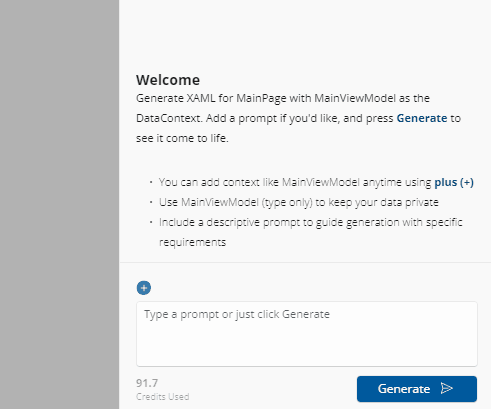

# Image Attachment in Chat

The **Hot Design Agent** supports **image attachment**, allowing you to include images in your chat prompts. This feature enables you to reference visual designs, mockups, screenshots, or reference images when requesting AI-assisted UI generation and modifications.

## Supported Image Formats

The image attachment feature supports the following file formats:

- **`.jpg` / `.jpeg`** — JPEG images
- **`.png`** — PNG images (with transparency support)

> [!TIP]
> **PNG** is recommended for images with text or detailed UI (thanks to lossless compression and transparency support), while **JPEG** is suitable for photos or gradients where smaller file sizes are preferred.

## Attaching Images to Chat

1. In the **Chat** panel, locate the **file attachment button** (usually a paperclip or plus icon).
2. Click the button to open the **file picker dialog**.
3. Browse your file system and select one or more image files.
4. The images appear as **thumbnail chips** in the chat input area.
5. Type your chat prompt and send — the images are included with your message.

  

## Image Thumbnails in Chat

Once attached, images appear as **small thumbnail chips** (16x16 pixels) in the chat input area. This compact representation shows you at a glance which images are included with your message without cluttering the interface.

### Managing Attached Images

- **View Full Image**: Click a thumbnail to see a preview of the image.
- **Remove Image**: Click the **X button** on the thumbnail to remove that image from your message before sending.
- **Multiple Images**: You can attach multiple images in a single message.

  

## Using Images in Chat Prompts

### Describe Your Design Intent

When attaching images, include a clear description in your chat message. For example:

**Example 1 — Design Mockup**:
> "Here's a mockup of a product card. Can you generate XAML that matches this layout? The card should show an image, product name, price, and a button."
> *(Attach: mockup.png)*

**Example 2 — Screenshot Reference**:
> "I want a sidebar that looks like this. The icons are on the left, labels on the right. Make it dark-themed."
> *(Attach: sidebar-reference.png)*

**Example 3 — Multiple References**:
> "Use these two designs as reference. The top panel should look like the first image, and the bottom section like the second image."
> *(Attach: header.png, footer.png)*

### Chat Agent Processing

The **Hot Design Agent** will:

1. **Analyze** the attached images to understand layouts, colors, and design intent
2. **Read** your text description to understand your requirements
3. **Generate** XAML code that matches the visual reference
4. **Suggest** responsive layouts and best practices based on the design

## Image Size and Performance

### Recommended Image Specifications

- **Max size**: No strict limit, but **smaller images process faster**
- **Recommended**: **1-4 MB** per image for optimal performance
- **Resolution**: **1024x768 pixels or smaller** is typically sufficient for design reference

### Large Images

If you attach very large images (10+ MB):

- Processing may take longer
- The agent may down-scale internally to optimize processing
- Consider cropping or resizing images before attachment for faster chat responses

> [!NOTE]
> Image quality matters more than size. A crisp 500x500 image is more useful than a blurry 2000x2000 image.

## Practical Use Cases

### 1. Design Mockup to XAML

You have a Figma or Adobe XD mockup. Attach a screenshot and ask:

> "Generate a XAML layout for this mobile app design. Include responsive breakpoints for phone and tablet."

### 2. Reference Component Library

Show the agent examples of existing components and ask:

> "Here are three button styles from our design system. Create XAML that implements all three variants."

### 3. Layout Inspiration

Attach screenshots from other apps and ask:

> "I like this navigation pattern from the reference image. Can you build a similar sidebar navigation for my app?"

### 4. Screenshot-Driven Iteration

After generating UI, take a screenshot and ask for refinements:

> "Here's what my app looks like now. Make the buttons larger and add more spacing between sections."

## Limitations and Considerations

### What Images Can Help With

- Layout and positioning reference
- Color palette and theme reference
- Component sizing and proportions
- Navigation structure and flow
- Typography and text layout

### What Images Cannot Do

- Replace detailed text descriptions (always provide context)
- Guarantee pixel-perfect matching (XAML rendering varies by platform)
- Replace accessibility requirements (describe alt text, keyboard navigation separately)
- Handle animated or interactive behaviors (describe in text)

### Best Practices

1. **Combine Images with Descriptions**: Always include both visual reference and written requirements.
2. **Use Clear Images**: Ensure mockups and screenshots are sharp and readable.
3. **Crop Irrelevant Areas**: Remove unnecessary parts of screenshots to focus the agent's attention.
4. **Provide Color Context**: Mention color palette or theme if not obvious from the image.
5. **Specify Platforms**: Mention if the design is for mobile, web, or desktop.

## Related Topics

- [**Hot Design Agent**](xref:Uno.HotDesign.Agent) — Overview of AI-powered design assistance
