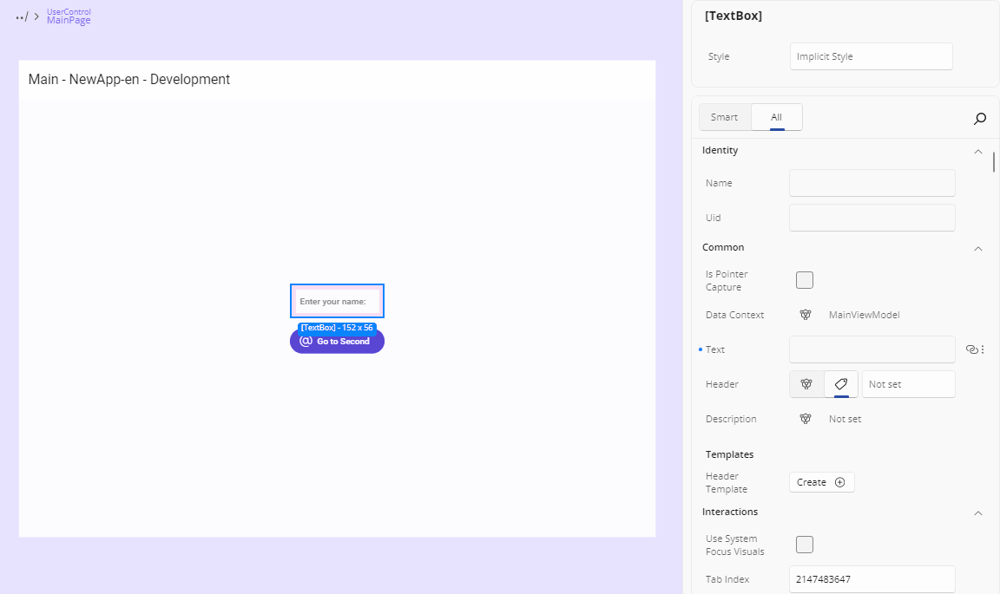
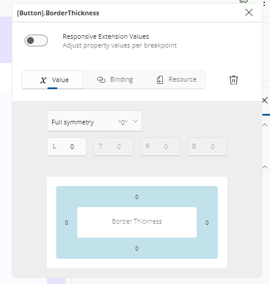
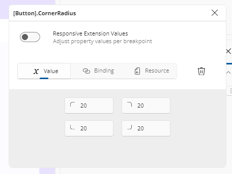
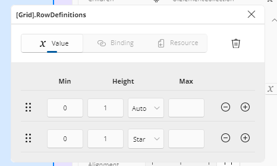
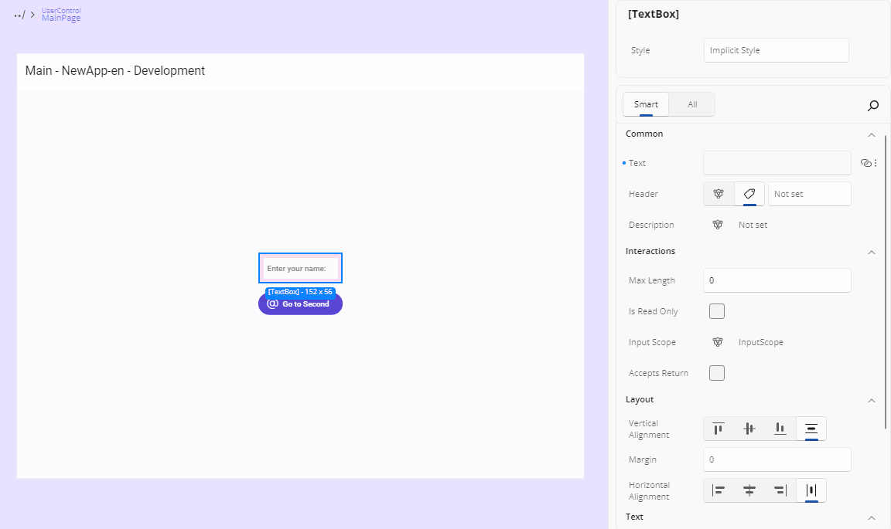

# Advanced Flyout

The **Advanced Flyout** opens when you click the **Advanced** button (three dots) on the right side of a property.

This flyout allows you to define how a property value is set. You can assign a direct **Value**, use a **Binding**, apply a **Resource**, or define responsive behavior using **Responsive Extensions**. In this section, we'll cover **Value**, **Binding**, and **Resource**. For more on Responsive Extension, see the [Responsive Extensions guide](xref:Uno.HotDesign.Properties.AdvancedFlyout.ResponsiveExtensions).

The flyout opens as a dialog next to the property row. Its header shows the element summary and the property name — or *\<Property> on \<N> elements* for a multi-selection. You can drag it out of the way, and close it with its **X** button. It closes automatically when the selection changes to different elements, and stays open across a refresh of the same selection.

## Choosing the Value Source

A segmented source bar at the top offers **Value**, **Binding**, and **Resource**, with the tab matching the property's current value preselected. A source is disabled where it cannot apply:

| Source | Disabled when |
| --- | --- |
| **Value** | The property has no editable value editor |
| **Binding** | The property is not bindable |
| **Resource** | No resource of a compatible type exists |

A **Reset** button clears the property's XAML value — including any responsive breakpoint values, and the binding fields of a binding-sourced property.

If the property's value changes from elsewhere while the flyout is open — an undo, or a gesture on the canvas — the flyout's editors refresh to the new value.

## Value

This is the default way of setting a property value. Depending on the property type, you'll see different editors:

### TextField

For `string`, `int`, `decimal`, or similar types, a simple **TextField** is shown.

### Thickness and Corner Radius Editor

For layout-related properties like `Padding`, `Margin`, `BorderThickness`, and `CornerRadius`, clicking the three-dot **more options** button next to the property opens a flyout with specialized editors.

- **Thickness Editor:** Allows setting individual values for Left, Top, Right, and Bottom. By default, a single field sets all sides equally. Click the center button once to enable the top text field - one for horizontal (left and right) and one for vertical (top and bottom). Clicking the button again enables the four fields, letting you set individual values for Left, Top, Right, and Bottom.

- **Corner Radius Editor:** Similar to the Thickness Editor, it displays four text fields, each with an icon indicating which corner (TopLeft, TopRight, BottomRight, BottomLeft) the field corresponds to. All fields are enabled by default, so you can enter values for each corner immediately.

## Grid Column & Row Editors

When you open the advanced flyout on a `ColumnDefinitions` or `RowDefinitions` property, you get a full table editor. Here’s what you can do:

- **Reorder**  
  Drag the ⋮⋮ handle to change the order of your rows/columns.

- **Min / Size / Max**  
  - **Min**: minimum pixel size  
  - **Size**: choose between `Auto`, a fixed pixel value, or `*` (star) for weighted sizing  
  - **Max**: maximum pixel size  

- **Add / Remove**  
  - Click **+** to insert a new definition below the current row  
  - Click **–** to delete the current definition  
  (the delete button is disabled once only one definition remains)

## JSON Mock Data for object-typed Properties

For a property typed as `object` — `DataContext` is the common case — the **Value** pane offers a **Text / JSON** toggle. Switching to **JSON** shows a multi-line editor for authoring structured mock data, so you can see a data-bound layout render without writing a view model.

Valid JSON is applied when the editor loses focus: the running app picks it up so the canvas reflects the mock data, and the value is persisted into your XAML. Invalid JSON shows an inline error identifying the line and position of the problem, and nothing is applied or written. JSON that exceeds the size or nesting-depth caps is treated as invalid the same way.

An empty (or whitespace-only) editor sets no value and does not destructively clear an existing one, and toggling between **Text** and **JSON** does not lose the current value.

Re-selecting a property whose value was authored this way reopens the flyout with **Value** and **JSON** active and the JSON populated; the property grid shows the value as **JSON**.

<!-- TODO(image): Screenshot of the Advanced Flyout on a DataContext property, showing the Text/JSON toggle with JSON selected and a small object authored in the multi-line editor. -->

> [!NOTE]
> A non-`object` property shows no **Text / JSON** toggle.

## Binding

Binding allows for a dynamic data connection between your UI and data source. Here's a breakdown of the fields available:

- **Type**: Choose the type of binding:
  - `None`: Removes an existing binding from the property.
  - `Binding`: Standard runtime binding.
  - `x:Bind`: Compile-time binding with better performance and error checking.
  - `AncestorBinding`: Binds to a parent element in the visual tree.
  - `ItemsControlBinding`: Used for bindings inside item templates.

  The two toolkit binding types — `AncestorBinding` and `ItemsControlBinding` — are hidden when your app does not reference Uno Toolkit. `AncestorBinding` adds an **Ancestor Type** suggestion field listing the element's ancestor types, and shows *Type must be set* while it is empty. `ItemsControlBinding` is only valid when the element has an `ItemsControl` ancestor; otherwise it shows *Only available inside an ItemsControl*.

- **Path**: Define the property path within your DataContext. The field offers a tree picker over the data context's property hierarchy, expandable level by level; selecting a node sets the path and saves the binding. For `x:Bind` the path can also be typed, and typed paths are validated against the path syntax and against the known member tree.

  When the data context is null the picker shows *DataContext is Null. No items to display.*

  For `x:Bind`, the path dropdown has an **Instance / Static** switch at the top:
  - **Instance** (default): the members of the binding's source — the page or `UserControl` code-behind, or, inside a `DataTemplate`, the type set as `x:DataType`.
  - **Static**: public static properties and parameterless static methods declared on any non-framework type in your application project or a referenced project in your solution, grouped by their declaring type (your current class is labeled *"current class"*). Selecting one produces a type-qualified compiled binding such as `{x:Bind local:AppSettings.Theme}` or `{x:Bind utils:Formatters.Currency()}`, and the required XML namespace is declared for you automatically. Static bindings are read-only (`OneTime`). The switch appears only for `x:Bind`, and only when static members are available.

- **Mode**: Select how the binding flows:
  - `OneTime`: Sets the value once.
  - `OneWay`: Updates the UI when the source changes.
  - `TwoWay`: Syncs changes both ways between UI and source.

### Advanced

- **Converter**: Select a value converter from your app. The list will show available converter classes defined in your project. Converters are used to transform the data between the source and the UI. To see the available options, start typing a converter name and it will be listed.

- **Converter Parameter**: An optional extra input for the converter. This lets you pass additional information to adjust how the conversion works. For instance, you might use it to pass a format string or a multiplier.

- **Converter Language**: Sets the language (culture) used by the converter. This can affect things like number formatting or date parsing. For example, using `en-US` will format the number `1234.56` as `1,234.56`, while `de-DE` would format it as `1.234,56`.

- **Element Name**: Binds the property to another UI element on the page by its `x:Name`. This is helpful when you want to reference values from sibling controls.

- **Fallback Value**: The value to use if the binding fails or the source is missing.

- **Target Null Value**: The value to use when the binding result is `null`.

- **Update Source Trigger**: Controls when the data flows from the UI back to the source: `Default`, `Explicit`, `PropertyChanged`, or `LostFocus`.

Every change to a **valid** binding is saved automatically — there is no separate confirm step. An invalid binding configuration is not saved.

### Binding Validation

The editor tells you when a binding will not work:

- **Binding type mismatch** — the selected path's type is not compatible with the property's type. If a converter is set, this downgrades from an error to a warning, since the converter may well bridge the two.
- For `x:Bind`, an **empty path** is invalid, and `TwoWay` mode is rejected for a read-only or static member.
- Inside a `DataTemplate` with no `x:DataType`, the picker shows **Missing x:DataType for DataTemplate**.

### x:Bind Inside a DataTemplate

`x:Bind` is offered for elements inside a `DataTemplate`, and the path picker enumerates the members of the type set as the template's `x:DataType`.

When the template has no `x:DataType` yet, set it first: select the `DataTemplate` node and use its `x:DataType` editor in the **Identity** category — the **Set data type…** field. With the type set, re-open the picker and it enumerates the new type's members. See [x:DataType](xref:Uno.HotDesign.Properties.Editors#xdatatype) for what that editor does.

Clearing `x:DataType` later leaves your existing `x:Bind` expressions in the XAML untouched — they simply show the missing-type state again.

## Resource

This option lets you apply a `StaticResource` or `ThemeResource` from your app. It's especially useful for brushes or predefined values, for example.

When focused, the input will suggest available resources whose type is compatible with the property, filtered as you type. Just click on one to assign it. The reference is written using the kind the resource actually is — `{StaticResource …}` or `{ThemeResource …}`.

Resources visible to the selected element — page-level and control-level dictionaries — are listed alongside your global app resources.

> [!NOTE]
> Assigning a `ThemeResource` shows the resolved value on the canvas immediately. Full responsiveness to theme changes takes effect once the XAML file has been written and reloaded.

## Responsive Extension

Where your app has the Responsive markup extension available and the property is a writable dependency property, the flyout also shows a **Responsive Extension Values** toggle. See [Responsive Extensions](xref:Uno.HotDesign.Properties.AdvancedFlyout.ResponsiveExtensions).

## Next Steps

- **[Different Editors](xref:Uno.HotDesign.Properties.Editors)**

  The Properties panel automatically selects the editor best suited for each property’s data type. Visit this page to explore all available editor types and when to use them.

- **[Template Editor](xref:Uno.HotDesign.Properties.TemplateEditor)**

  The **Template Editor** provides a visual canvas for creating and customizing control templates, enabling you to design complex UI structures without hand-coding XAML.

- **[Responsive Extensions](xref:Uno.HotDesign.Properties.AdvancedFlyout.ResponsiveExtensions)**

  **Responsive Extensions** let you define multiple values for a single property based on the screen size or form factor, ensuring your UI adapts seamlessly across devices.

- **[Counter App Tutorial](xref:Uno.HotDesign.GetStarted.CounterTutorial)**

  A hands-on walkthrough for building the [Counter App](xref:Uno.Workshop.Counter) using **Hot Design**, showcasing its features and workflow in action.
