# Editors

The Properties panel uses different types of editors depending on the property’s expected value. These editors make it easier to enter, select, or adjust values, ensuring that each property is edited in a way that matches its data type.

## DropDown

For properties with predefined values, like `Visibility`, you’ll see a dropdown. Click it to open the list and select the value you want.

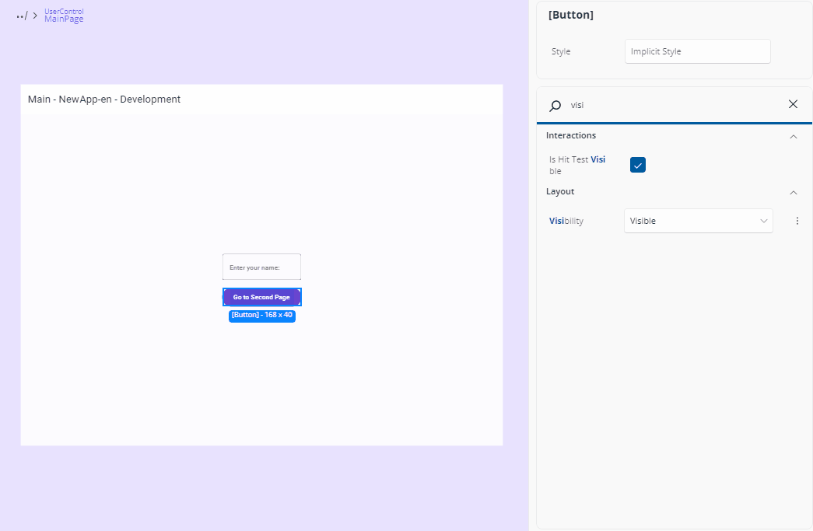

For properties with a fixed set of values and no dedicated editor, a combo box of those values is shown.

## TextField

For properties that accept text or numbers (like strings, decimals, or integers), a text field will be shown. Click it to focus and enter the value directly.

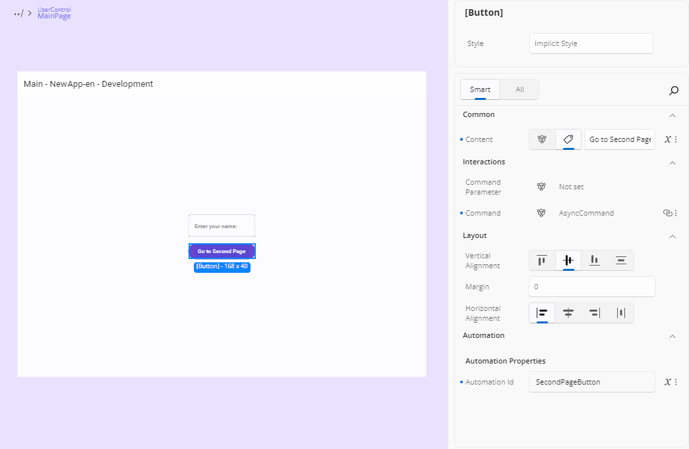

For properties like `Background` or `Foreground` that accept both predefined and custom values, the text field may suggest default values when it receives focus. A list will appear, showing commonly used options - you can simply click on one of the suggestions to apply it.

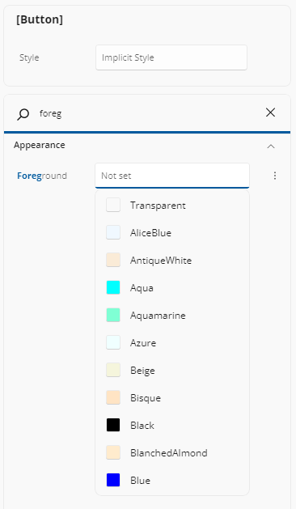

Text values are applied as you type. The `x:`-namespace properties are the exception: `x:Name` and its siblings are applied only when the editor loses focus. Renaming an element to a name that already belongs to another named element is flagged as invalid and is not applied.

### Numbers

A numeric property (`byte`, `short`, `int`, `long`, `float`, or `double`) is validated against the property's allowed range and applied as you type. Infinite and `NaN` values are shown as a placeholder with an empty box, and if the text is invalid when the editor loses focus the previous value is restored.

## CheckBox

For boolean properties (true or false), a checkbox is used. Click it to toggle between checked (true) and unchecked (false), which applies the value immediately.

A nullable boolean — or a multi-selection whose values differ — shows a three-state check box.

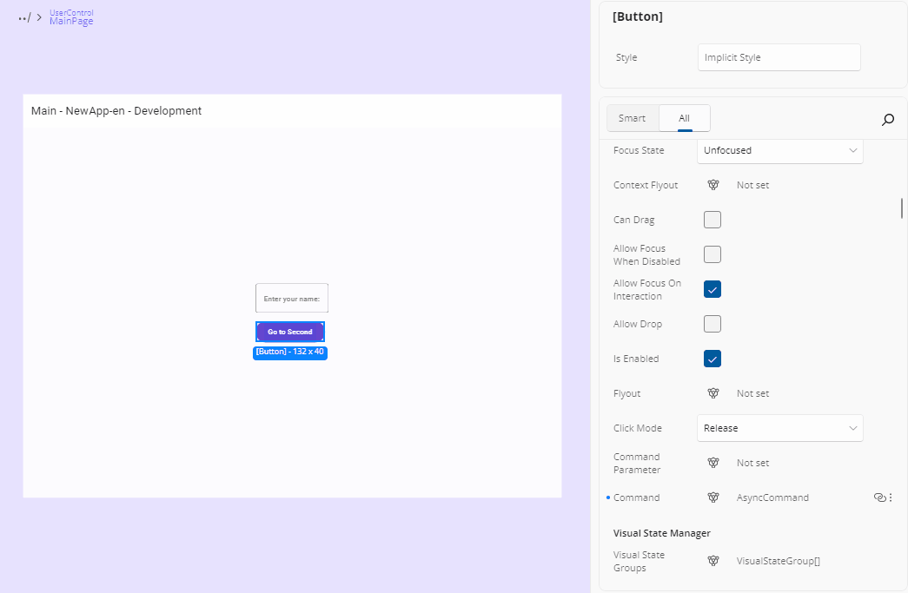

## Multiple Values

For properties that accept multiple values, simply click on the label showing the current selection. A menu will appear listing the available options—check the ones you want, and click outside the menu to close it. This is what a `[Flags]` enum gets, and the chosen names are displayed comma-separated.

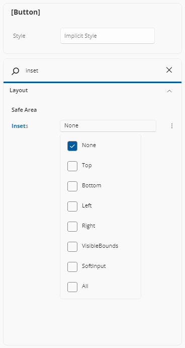

## Alignment Editors

Alignment editors display four visual options for alignment-related properties such as `VerticalAlignment`, `VerticalContentAlignment`, `HorizontalAlignment`, and `HorizontalContentAlignment`.

For vertical alignment, the options represent (from left to right): Top, Center, Bottom, and Stretch.

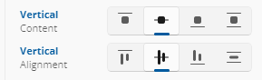

For horizontal alignment, the options represent: Left, Center, Right, and Stretch.

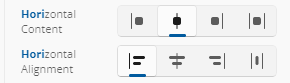

You can select the desired option by clicking on the corresponding icon.

## Orientation

When editing properties that accept orientation, you'll see two icon buttons: the first represents horizontal orientation with an arrow pointing left and right, and the second represents vertical orientation with an arrow pointing up and down. Just click the desired option to apply it.

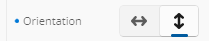

## Suggestion Boxes

Several property types offer a suggestion box: a text field you can type into, backed by a filtered list of the values that make sense for it. You can always type a value by hand as well.

| Property type | What the suggestions list |
| --- | --- |
| `Brush`, `SolidColorBrush`, `Color` | Named colors and matching color/brush resources, each with a color swatch. Typing a `#hex` value (3, 4, 6, or 8 digits) or a named color is accepted; selecting a resource applies a resource reference. |
| `ImageSource`, `Uri`, media source | Your app's assets, filtered to the extensions the property accepts. A valid path or URI may also be typed directly. |
| `FontFamily` | Your app's fonts. A font source may be typed manually when it matches no listed font. |
| `FontWeight` | Font weights, matched by name or by numeric weight (1-999). |
| `Style` | Style resources applicable to the element's type. With no explicit style set, the placeholder reads **Implicit Style**. |

Asset pickers only offer files of the right kind: an image property offers images and not a Lottie animation JSON, and a `LottieVisualSource` `UriSource` offers the animation JSON files in your package (prefixed with `ms-appx:///`) and no images. A property whose value is a web resource offers no local asset at all.

## Thickness and Corner Radius

`Margin`, `Padding`, `BorderThickness`, and other `Thickness` properties use a text box accepting standard `Thickness` syntax — one, two, or four numbers. A `CornerRadius` accepts one or four non-negative numbers.

For a guided, side-by-side editor, open the property's [Advanced Flyout](xref:Uno.HotDesign.Properties.AdvancedFlyout#thickness-and-corner-radius-editor).

## Grid Row and Column Definitions

A `Grid`'s `RowDefinitions` or `ColumnDefinitions` uses a text box accepting comma-separated grid lengths — for example `Auto,*,2*`. The [Advanced Flyout](xref:Uno.HotDesign.Properties.AdvancedFlyout#grid-column--row-editors) offers a full table editor with per-row Min/size/unit/Max fields, add and remove buttons, and drag reordering.

## Templates

For properties that use templates, a button labeled "Create" will appear if no template has been set yet, or "Edit" if a template already exists. Clicking this button will open the Template Editor. For more advanced details on how the Template Editor works, refer to our [Template Editor docs](xref:Uno.HotDesign.Properties.TemplateEditor).

The button is disabled when the value is a template *selector*, since there is no single template to open.

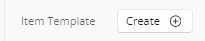

## x:DataType

Selecting a `DataTemplate` node exposes an editable `x:DataType` entry under the **Identity** category. Its drop-down opens a searchable list of your app's creatable types; selecting one writes `x:DataType` onto the `DataTemplate` element (declaring the namespace for you), and a reset option clears it.

Setting `x:DataType` is what unlocks `x:Bind` authoring inside that template — see the [Advanced Flyout](xref:Uno.HotDesign.Properties.AdvancedFlyout#binding).

For a template defined in a `ResourceDictionary` (`App.xaml` or a merged dictionary), the attribute is written into *that* file rather than into the page that consumes it — so the change applies to every consumer of the resource key, and takes effect once the resource dictionary hot-reloads.

Where the entry is not offered: on anything that is not a `DataTemplate`, on a `DataTemplateSelector`, and on a template with no app-writable source (a framework, theme, or external dictionary template).

> [!NOTE]
> A present-but-unresolvable `x:DataType` — a bad namespace, an unloaded assembly, a renamed type — shows the raw text with a warning affordance. That is visibly different from an absent attribute, which shows an empty picker ready to set.

## Visual States

When your app references Uno Toolkit, a **States** row appears under the **Visual State Manager Extensions** sub-header in the **Interactions** category. It lists the visual state groups declared by the selected control's applied template — including a template that comes from a `Style` or `ControlTemplate` in another file — as group headings with their states beneath them, in declaration order.

Pick at most one state per group. Selecting a second state in a group replaces the first, clearing a group's selection removes it from the value, and clearing every group removes the attribute from your XAML altogether. The written value is comma-separated in group declaration order — for example `Pressed, Focused`.

A control whose template declares no visual state groups shows an empty-state message explaining so.

## Properties with No Dedicated Editor

A property whose type has no editor shows its value read-only. You can still author a **Binding** or a **Resource** for it from the [Advanced Flyout](xref:Uno.HotDesign.Properties.AdvancedFlyout).

## Complex Types

Some properties support more advanced content types, also known as *Complex Types*. These are used when a property can accept a more structured element instead of just a simple value.

A common example is when setting an icon for a control. Instead of just choosing a predefined symbol, you might want to use a `BitmapIcon`, `FontIcon`, `SymbolIcon`, `PathIcon`, or another `IconElement`. When a property supports this, a specific **Complex Type icon** will appear next to it.

Another case for Complex Types is when defining the `Layout` property of an `ItemsRepeater` element.

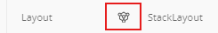

In some cases, a property might support both a literal value (like a string or number) *and* a Complex Type. When that happens, both the Complex Type icon and a tag icon (representing the literal mode) will be visible. You can choose either approach by clicking the corresponding icon. Content properties such as `Button.Content`, and `object`-typed properties such as `DataContext`, are the common examples.

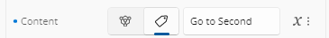

> [!TIP]
> For an `object`-typed property such as `DataContext`, the [Advanced Flyout](xref:Uno.HotDesign.Properties.AdvancedFlyout#json-mock-data-for-object-typed-properties) additionally offers a **JSON** mode for authoring structured mock data without writing a view model.

### Editing a Complex Type

To edit a Complex Type, simply click the icon. The Properties panel will switch to a new view. At the top, you’ll see a dropdown listing all available Complex Types for that property. Click the arrow to browse the options. Once you've selected a type, the UI will show the editable properties for that specific Complex Type.

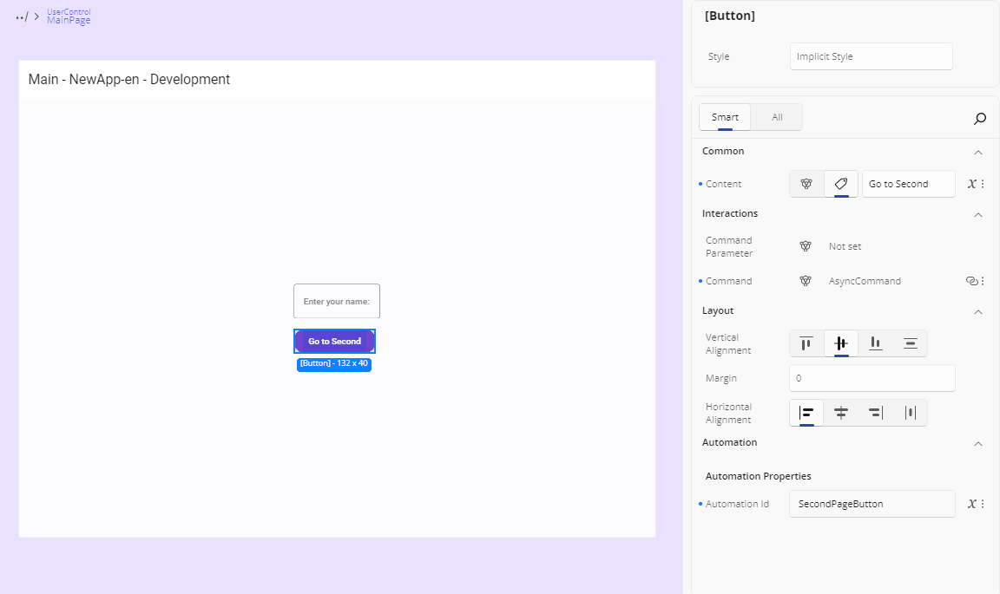

### Leaving the Complex Type editor

After you're done, to return to the default Properties view, just click the name of the main element you're editing, shown in the top-left breadcrumb area of the Properties panel. You'll then see that the chosen Complex Type appears next to the property, confirming it's been set.

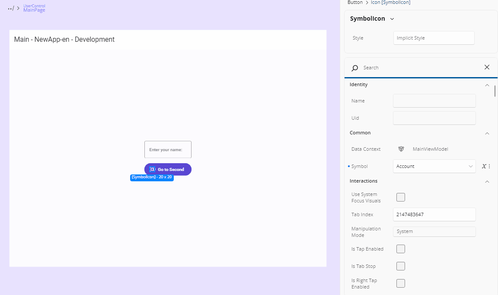

## Next Steps

- **[Advanced Flyout Editor](xref:Uno.HotDesign.Properties.AdvancedFlyout)**

  Use the **Advanced Flyout** to choose how a property value is provided: enter a literal **Value**, set up a **Binding**, reference a **Resource**, or apply **Responsive Extensions** for adaptive layouts.

- **[Template Editor](xref:Uno.HotDesign.Properties.TemplateEditor)**

  The **Template Editor** provides a visual canvas for creating and customizing control templates, enabling you to design complex UI structures without hand-coding XAML.

- **[Responsive Extensions](xref:Uno.HotDesign.Properties.AdvancedFlyout.ResponsiveExtensions)**

  **Responsive Extensions** let you define multiple values for a single property based on screen size or form factor, ensuring your UI adapts seamlessly across devices.

- **[Counter App Tutorial](xref:Uno.HotDesign.GetStarted.CounterTutorial)**

  A hands-on walkthrough for building the [Counter App](xref:Uno.Workshop.Counter) using **Hot Design**, showcasing its features and workflow in action.
