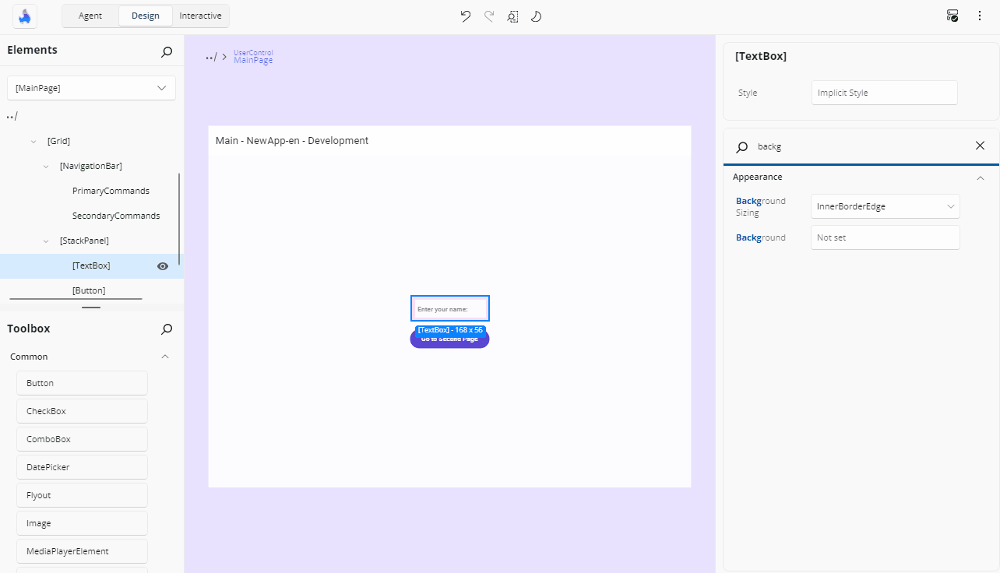

# Using Resources in Hot Design

In Hot Design, you can assign values to properties using **resources**, which contain predefined values stored in your application that promote reuse and consistency. These can include brushes, strings, thicknesses, numbers, and more.

## What Are Resources?

Resources are values defined in XAML using keys and are typically defined in `App.xaml`, `Page.Resources`, or `MergedDictionaries`. For example:

- `StaticResource` – Resolved once when the control is loaded.
- `ThemeResource` – Dynamically resolved based on the current app theme (Light or Dark).

```xml
<SolidColorBrush x:Key="AccentBrush" Color="#FF0078D7" />
```

## Applying a Resource

To assign a property from a resource, open the Advanced Flyout by clicking the three-dot button next to a property.

- Select the Resource tab.
- Type the key name of your resource, or choose from the suggestions list that appears.
- Once selected, the property will display a resource-indicator icon.



Hot Design supports auto-suggest for both `StaticResource` and `ThemeResource`, making it easier to pick from available keys without memorizing them. Suggestions are filtered to resources whose **type is compatible** with the property you are editing, and narrow further as you type. The reference is written using the kind the resource actually is — `{StaticResource …}` for a static resource, `{ThemeResource …}` for a theme resource.

> [!IMPORTANT]
> Hot Design writes a resource **reference**, never a resource **definition**. Picking a resource for a property adds the markup expression to your element; it does not create or modify the resource itself. Define the resource in your XAML first, then assign it here.

## Resource Scope

The available resource keys depend on where they're defined:

- **Local**: in the same page or control. Dictionaries visible to the selected element are listed alongside the global ones.
- **Application-wide**: in App.xaml or globally merged dictionaries.
- **Themed resources**: change automatically with Light/Dark mode.

> [!NOTE]
> Prefer `ThemeResource` for brushes or fonts that should adapt to theme changes.
>
> When you assign a `ThemeResource` from the grid, the canvas immediately shows the resolved value. Full responsiveness to theme changes takes effect once the XAML file has been written and reloaded.

## Resources as a Source of Previews

Named styles and keyed data templates in your resources also show up as [Previews](xref:Uno.HotDesign.Previews), so you can open a styled variant on its own and see it without hunting for a screen that uses it. Styles your app declares in its own XAML appear on the **App** tab; styles from a theme (Material, SimpleTheme) or a merged library dictionary appear on the **System** tab.

## Editing or Removing a Resource

To remove a resource assignment:

- Reopen the Advanced Flyout and switch back to the Value tab to assign a literal value, or
- Clear the input field in the Resource tab.

## Common Use Cases

- Background, Foreground, and BorderBrush → Use brush resources.
- FontSize and Padding → Use number/thickness resources.
- Text → Use localized string resources.
