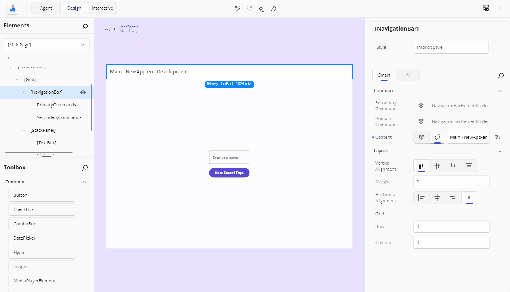

# Responsive Extensions

Responsive Extensions let you define different values for a property depending on the screen size. This helps you build adaptive UIs that look and behave better on different devices or window sizes.

In the Advanced Flyout, the **Responsive Extension** toggle will only be enabled if the selected property supports responsive values — the Responsive markup extension has to be available in your app, and the property has to be a writable dependency property. When toggled on, it allows you to configure different values for various screen sizes using collapsible sections.

For more advanced usage and technical details, see the [Responsive Extensions documentation](xref:Toolkit.Helpers.ResponsiveExtension).

## Setting Values According to the Screen Size

Inside the **Advanced Flyout**, you'll find a toggle called **Responsive Extension Values**. Turning it on enables responsive editing for the selected property.

Once enabled, collapsible sections appear for each screen size category:

- **Narrowest**
- **Narrow**
- **Normal**
- **Wide**
- **Widest**

Each category has its own toggle switch, so you can choose which breakpoints to use. Below the section title, the specific pixel width that activates it is shown to help you understand when that value will apply.

After activating a breakpoint, an editor for that property will appear. You can now enter a value that will only apply when the screen is within that size range. This editor behaves just like the regular one you use for the default value - if it's a number, you'll get a text field; if it's a Brush, you'll get suggestions, and so on. Each section also shows a pill with its current value, so you can read all five at a glance.

Only **one section is open at a time**, which keeps the flyout a manageable size.

> [!NOTE]
> Per-breakpoint values can be a literal **Value** or a **Resource**, but not a **Binding** — the **Binding** source is unavailable inside a breakpoint section, with a tip explaining that bindings are not supported with the Responsive Extension. For the same reason, the **Responsive Extension Values** toggle is disabled while the property's current value *is* a binding.

## Resetting Values

To remove a value set for a specific breakpoint, click the **trash icon** next to the editor. This will clear the responsive override and fall back to the default property value or another applicable one.

Turning the **Responsive Extension Values** toggle back off collapses the property to the **Normal** breakpoint's value, so the property keeps a single sensible value instead of losing everything.

The flyout's **Reset** button clears the property entirely, including every breakpoint value.

### How the Value Reads in the Property Grid

A property using the Responsive Extension shows **Responsive** as its value in the grid, or **Mixed** where the breakpoints carry different values, with the responsive indicator on its **Advanced** button.

## Next Steps

- **[Different Editors](xref:Uno.HotDesign.Properties.Editors)**

  The Properties panel automatically selects the editor best suited for each property’s data type. Visit this page to explore all available editor types and when to use them.

- **[Advanced Flyout Editor](xref:Uno.HotDesign.Properties.AdvancedFlyout)**

  Use the **Advanced Flyout** to choose how a property value is provided: enter a literal **Value**, set up a **Binding**, reference a **Resource**, or apply **Responsive Extensions** for adaptive layouts.

- **[Template Editor](xref:Uno.HotDesign.Properties.TemplateEditor)**

  The **Template Editor** provides a visual canvas for creating and customizing control templates, enabling you to design complex UI structures without hand-coding XAML.

- **[Counter App Tutorial](xref:Uno.HotDesign.GetStarted.CounterTutorial)**

  A hands-on walkthrough for building the [Counter App](xref:Uno.Workshop.Counter) using **Hot Design**, showcasing its features and workflow in action.
