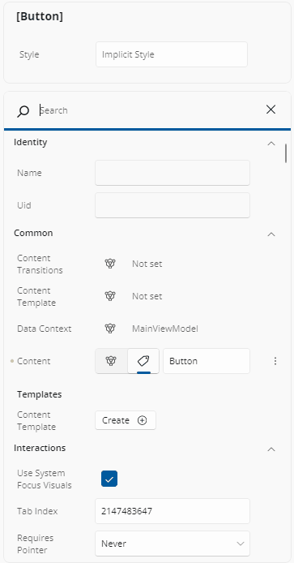
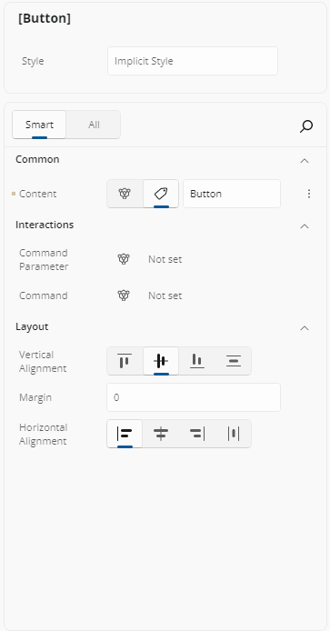
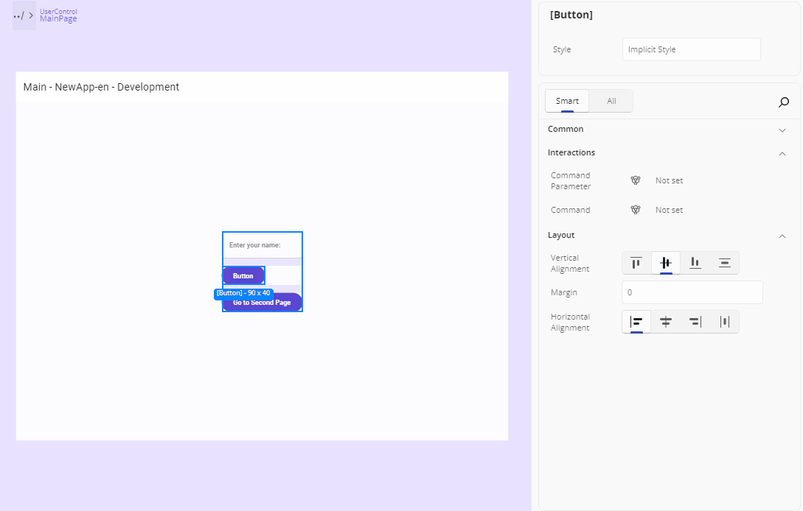
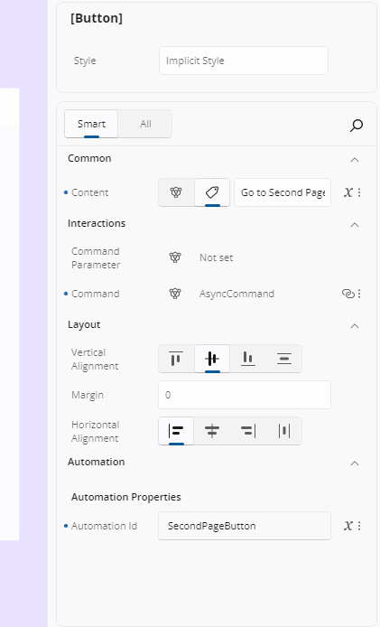
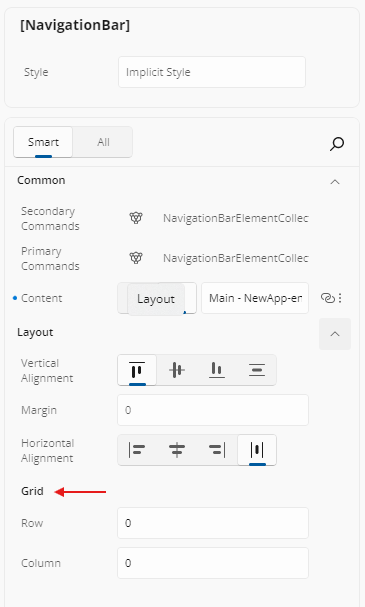

# Properties

## General

The Properties panel allows you to view and edit the attributes of any element selected on the canvas or in the Elements panel. As soon as an element is selected, its properties are loaded into the Properties panel, allowing you to make changes based on the property's type and expected value.

When nothing is selected, the panel shows a **No selection** message inviting you to select an element on the canvas or from the Elements panel.

Once an element is selected, the panel is laid out as:

- An **identity card** at the top, summarizing the element and showing its identity rows (such as `Name`).
- Below it, a searchable, categorized list of the element's properties.

Selecting **two or more** elements summarizes the selection in the identity card, and any property whose value differs across the selection shows the placeholder **Multiple Different Values** instead of a value.

### Search

You can quickly find a specific property by using the search box located below the **Style** section. To open the search input, click on the magnifying glass icon. As you type, the results will be filtered in real time. To clear your search, click the **X** button inside the search box.

Search matches on a property's name or display name, is case-insensitive, and is forgiving about spaces — typing `corner radius` matches `CornerRadius`. Attached properties also match on their owning type name, so typing `Grid` finds `Grid.Row` and `Grid.Column`. The matching fragment of each label is highlighted and categories containing matches expand automatically.

If nothing matches, a **No matching results found. Clear input and try again** message replaces the list. The query is cleared when you switch filter tab or change the selection.

### Smart and All Tabs

At the top of the Properties panel, you'll see two tabs: **Smart** and **All**.

- **Smart** (the default) displays the most commonly adjusted properties for the selected element, providing quicker access for typical use cases. Any property that is explicitly set in your XAML is listed too, regardless of its priority — so you never lose sight of something you set.
- **All** shows the complete list of properties available for that element.

Just click the tab you want to switch between views.

A tab that would show nothing for the current selection is disabled, and if the tab you were on becomes disabled the first enabled tab is selected for you. Internal-only properties are never listed under either tab.

### Expandable Sections

To make things easier to navigate, properties are grouped into sections such as *Appearance*, *Common*, *Layout*, *Text*, *Interactions*, *Automation*, *Transform*, and *Miscellaneous* - depending on the selected element. You can expand or collapse these groups by clicking the arrow next to the group title. This helps reduce visual clutter and lets you focus only on the property groups you're working with. Categories are expanded by default.

Within a category, two kinds of property get their own sub-header: template-typed properties appear under **Templates**, and attached properties appear under a sub-header named after the owning type.

### Drilling Into Nested Values

Navigating into a complex property value or a collection item shows a **breadcrumb** trail above the properties. Clicking an earlier breadcrumb entry takes the selection back to that level.

### Assistive Text

If you enter an incorrect value in a property, a message will show up just below it. A yellow message means a warning, and a red one means an error. This helps you understand what went wrong so you can fix it quickly.

<!-- TODO(image): Screenshot of a property row showing an assistive-text validation message beneath it — one example in the warning (yellow) style and one in the error (red) style. -->

## Applying Styles

You can apply predefined styles to your elements. To do this, go to the Style section at the top of the Properties panel. There you'll see a field called "Implicit Style". Click it to view the available styles for the selected element, or type in the name to filter the list. Once you click a style, it will be applied to your element. To remove it, click the "More Options" icon next to the field and choose "Reset".

Where template snippets are enabled and templates exist for the selected element's type, the identity card also offers a **Templates** button. It opens a flyout titled *\<Type>.Templates*; selecting a template applies it to the element. When there are none, the flyout reads **No templates available for this type.**

## Property Value Indicators

Each property in the Properties panel includes an **Advanced** button to the right of its value. This button uses an icon to indicate how the property's value is currently defined. It helps you quickly understand whether the value is set directly, comes from a binding, a resource, or is responsive. Here's what each icon means:

-  — No value is set; the property is using its default value.
-  — A **Literal** or **XAML-defined** value has been set directly.
-  — A **Binding** is being used for this property (`Binding`, `x:Bind`, `AncestorBinding`, or `ItemsControlBinding`).
-  — The value comes from a **Resource** (`StaticResource` or `ThemeResource`).
-  — The **Responsive Extension** is used, with different values for different screen sizes (Mixed Responsive).

The **Advanced** button is shown while the pointer is over the row, while the row has focus, or while its flyout is open — and is always shown when the property is set in XAML or carries a design-time value.

Clicking the **Advanced** button opens a flyout with three settings for each property: Value, Binding, or Resource. For more information on how the **Advanced Flyout** works please refer to our [Advanced Flyout docs](xref:Uno.HotDesign.Properties.AdvancedFlyout).

### What the Value Text Tells You

Where a property has no ordinary value to display, the value area reads:

| Text | Meaning |
| --- | --- |
| **Not set** | The property has neither a local nor a runtime value |
| **Null** | An explicit null value |
| **JSON** | The value was authored as JSON (see the [Advanced Flyout](xref:Uno.HotDesign.Properties.AdvancedFlyout)) |
| **Responsive** | A Responsive markup value |
| **Mixed** | Different values per breakpoint |
| **Multiple Different Values** | The selected elements disagree on this property |

A property whose value is a markup expression — a binding, a resource reference, or a custom markup extension — is shown as **read-only** text of the expression, with the full expression available as a tooltip. This protects the expression from being replaced by accident.

## XAML Indicator (Blue-Dot)

The blue dot next to a property name indicates "this value was set in your XAML." Hover over it to see exactly how:

- **Literal**: hard-coded in XAML  
- **Binding**: data-bound in XAML  
- **Resource**: pulled from a resource dictionary  
- **Responsive Extension**: value provided via responsive extension

The dot changes color to tell you more:

- **Amber** — the current value comes from design-time (mock) data rather than from your document. Replace it with a real value before shipping.
- **Disabled (gray)** — the property is read-only.

## Reset a Property to Its Default

There are three ways to clear a value:

- **Right-click the dot indicator** on the row and choose **Reset**. This removes the property from your XAML, reverting the element to its default or inherited value. The command is disabled for a read-only property.
- Click the **Reset** button in the property's [Advanced Flyout](xref:Uno.HotDesign.Properties.AdvancedFlyout). This also clears any responsive breakpoint values, and resets the binding fields of a binding-sourced property.
- **Delete all the text** in a text-based editor.

Hot Design also avoids writing redundant markup: typing a value identical to the property's default removes the attribute from your XAML rather than writing it.

## Read-Only Properties

A read-only property — `ActualWidth`, for example — is shown so you can inspect its value, but its inline editor is disabled and it offers no Advanced flyout, no reset, and no binding or resource assignment.

## Attached Properties

Some properties shown here aren't defined on the control itself but come from another class—these are called **attached properties**. In the Properties grid:

- They appear under a **subheader** with the owner type (e.g. **Grid**).
- Setting a value here will **add** the attached property to your XAML automatically.
- Their editors work just like normal properties—`int`s, `enum`s, `bool`s, or even complex types get the appropriate control, with the same indicators, reset, binding, and resource behavior.
- They match search on their owning type name, so typing `Grid` finds `Grid.Row`.

  

## Editing Collections

Navigating into a collection property switches the panel to a **collection editor** titled with the collection type. From there you can:

- Click an item to drill into its own properties.
- **Reorder** items by dragging, which reorders the elements in your XAML.
- **Delete** an item with its delete button.
- **Add** an item: the **Add** button opens a searchable list of the allowed item types, and picking one appends a new element.
- **Clear** the whole collection value.

For a single complex property that has no value yet (**Not set**), a type picker button opens a searchable flyout of acceptable types — with a search box once there are ten or more. Selecting a type creates an instance of it as the property's value; the flyout's **Reset** command clears it again.

## How Your Edits Reach the App and the File

When you commit a property edit, the running app's visual tree is updated first, so the canvas reflects the change right away; the XAML file is written asynchronously afterwards. Rapid changes to the same property are coalesced (over roughly half a second) into a single applied change, and into a single undo step.

Changes that need the visual tree to be rebuilt — changing an `x:Name`, for example — show an **Updating App** overlay while a Hot Reload runs, and the overlay is removed when the refreshed UI is available.

If an edit cannot be applied, or would produce XAML that does not parse, nothing is written to your file and you are told why. Every applied edit is undoable, and undo restores the previous value in both the running app and the XAML document while preserving your selection.

## Next Steps

- **[Different Editors](xref:Uno.HotDesign.Properties.Editors)**

  The Properties panel automatically selects the editor best suited for each property's data type. Visit this page to explore all available editor types and when to use them.

- **[Advanced Flyout Editor](xref:Uno.HotDesign.Properties.AdvancedFlyout)**

  Use the **Advanced Flyout** to choose how a property value is provided: enter a literal **Value**, set up a **Binding**, reference a **Resource**, or apply **Responsive Extensions** for adaptive layouts.

- **[Template Editor](xref:Uno.HotDesign.Properties.TemplateEditor)**

  The **Template Editor** provides a visual canvas for creating and customizing control templates, enabling you to design complex UI structures without hand-coding XAML.

- **[Responsive Extensions](xref:Uno.HotDesign.Properties.AdvancedFlyout.ResponsiveExtensions)**

  **Responsive Extensions** let you define multiple values for a single property based on screen size or form factor, ensuring your UI adapts seamlessly across devices.

- **[Counter App Tutorial](xref:Uno.HotDesign.GetStarted.CounterTutorial)**

  A hands-on walkthrough for building the [Counter App](xref:Uno.Workshop.Counter) using **Hot Design**, showcasing its features and workflow in action.
