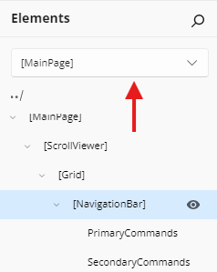
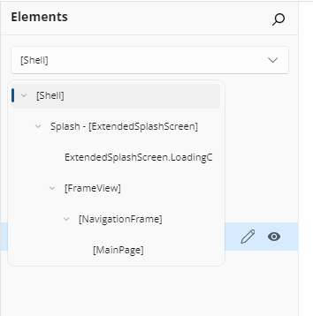
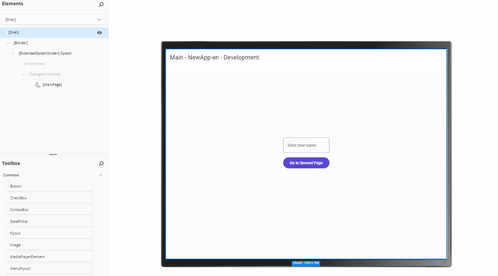

# Scope Selector

The **Scope Selector** lets you quickly navigate and edit nested UI contexts in your application. When working with **UserControls** and **DataTemplates**, the Scope Selector helps you zoom into the specific part of the UI tree you want to design, rather than editing the entire page structure.

## Understanding Scopes

In Hot Design, a **scope** is an editing context that represents a specific level of your UI hierarchy:

- **Application Scope** — Your main app or page (the starting point)
- **UserControl Scope** — When editing inside a `UserControl`
- **DataTemplate Scope** — When editing inside a `DataTemplate` or `DataTemplateSelector`

For example, if your page contains a `ListBox` with a custom `DataTemplate`, you can:

1. Edit your page in **Application Scope**
2. Switch to **DataTemplate Scope** to design the content of each list item separately
3. Return to **Application Scope** when finished

This keeps your design focused and prevents accidental changes to parent layouts.

## Access the Scope Selector

The **Scope Selector** appears in the **Elements** panel as a read-only textbox with a dropdown arrow.

  

### Open the Scope Navigation Flyout

1. Click the **Scope Selector** textbox or the **dropdown arrow** next to it.
2. A **flyout** opens showing the **Scope Tree** — a hierarchical view of all available scopes (DataTemplates, DataTemplateSelectors, and UserControls) in your app.

  

## Navigate Scopes

### Select a Scope from the Tree

In the **Scope Navigation Flyout**:

1. **Expand** nodes by clicking the arrow next to them to reveal nested scopes.
2. **Click** on any scope name to navigate into that editing context.
3. The scope tree automatically expands to show your current location.

  

### Current Scope Display

The **Scope Selector** textbox always shows your current scope. For example:

- Empty or `Application` — You're editing the main page or app
- `MyDataTemplate` — You're inside a DataTemplate named "MyDataTemplate"
- `ItemTemplate → ItemDetailsTemplate` — You're in a nested scope (ItemDetailsTemplate inside ItemTemplate)

## Design Within a Scope

Once you navigate into a scope:

1. The **Canvas** shows only the content of that scope.
2. The **Elements** panel displays the visual tree of that scope.
3. The **Properties** panel lets you modify properties of elements within that scope.
4. Any changes you make are reflected only within that scope's boundaries.

This focused editing prevents you from accidentally modifying the parent layout or other unrelated parts of your app.

## Return to Parent Scope

To exit a scope and return to the parent context:

1. Open the **Scope Selector** flyout.
2. Click the **parent scope** in the tree (one level up).
3. Or, if there's a parent, you can click the **up/back button** in the scope tree header to go up one level.

You can continue navigating up until you reach **Application Scope**.

## Practical Use Cases

### Editing List Item Templates

1. Your page contains a `ListBox` with a custom `DataTemplate` for each item.
2. Open **Scope Selector** and navigate to the **ItemTemplate** scope.
3. Design the item layout (buttons, text, icons) in isolation.
4. Return to **Application Scope** to adjust the ListBox size or properties.

### Refining Complex DataTemplateSelectors

1. When you have multiple `DataTemplate` options in a selector, navigate to each template individually.
2. Edit each template's content without affecting others.
3. Use the scope tree to switch between templates quickly during iteration.

### Organizing Nested UserControls

1. If your page contains multiple **UserControls**, navigate into each one to design its internals.
2. Adjust layouts, colors, and bindings within each control in isolation.
3. Return to the main page to verify how they work together.

## Tips and Tricks

- **Keyboard Navigation**: Use arrow keys and Enter in the scope tree to navigate and select scopes.
- **Search**: If you have many scopes, some implementations may support typing to filter the list.
- **Auto-Expand Current**: The tree automatically expands to highlight your current scope position.
- **Quick Exit**: Click the flyout background or press **Escape** to close the scope selector without changing context.

## Related Topics

- [**Elements Panel**](xref:Uno.HotDesign.Elements) — Manage your visual tree structure
- [**Hot Design Agent**](xref:Uno.HotDesign.Agent) — Design complex templates with AI assistance
- [**Properties Panel**](xref:Uno.HotDesign.Properties) — Modify element properties within any scope
