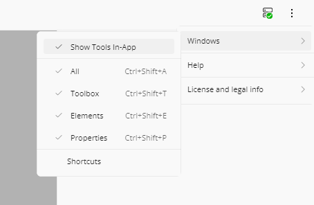
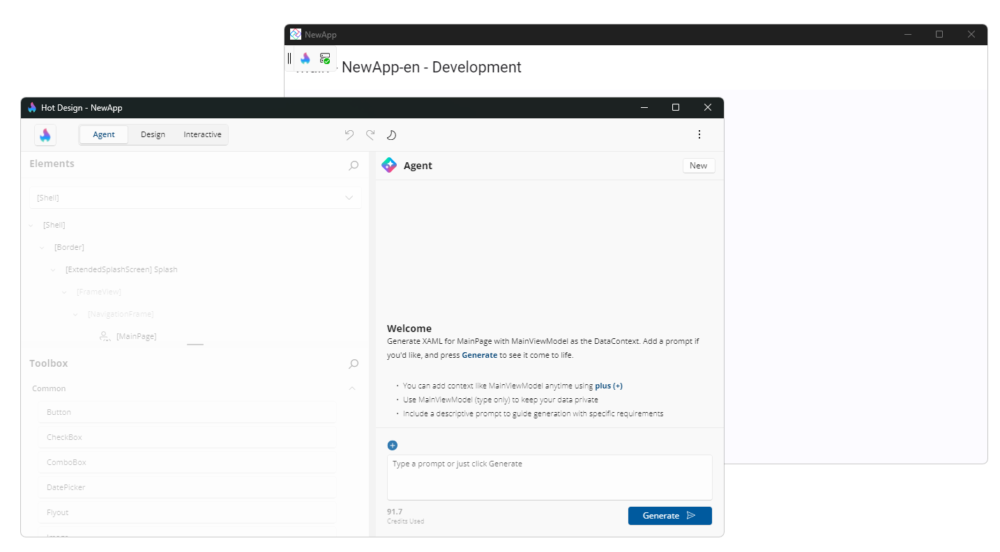

# Toolbar and External Tool Window

The **Toolbar** provides quick access to Hot Design tools and is now available in two configurations: **fixed in-app** or in a **separate external window**. This flexibility lets you choose the layout that best fits your workflow and screen space.

## Toolbar Overview

The **Toolbar** contains all the essential Hot Design controls:

- **Enter/Exit** Hot Design mode
- **Play/Pause** to test your app
- **Undo/Redo** changes
- **Form Factor** and zoom settings
- **Theme** toggle (light/dark)
- **Connection Status** and Hot Reload updates
- **Visibility Options** to show/hide tool panels

## Fixed In-App Toolbar

By default, the **Toolbar** appears as a **fixed bar at the top** of your running app window.

  

### Using the Fixed Toolbar

1. Click any toolbar button to activate its function.
2. Use keyboard shortcuts for quick actions (e.g., `K` to toggle **All Elements** visibility).
3. The toolbar remains visible as you design, without moving or resizing.

## External Tool Window

Alternatively, you can open Hot Design tools in a **separate external window** — useful when working on smaller screens or when you want to keep your app view clean and uncluttered.

### Enable External Tool Window

To move tools to an external window:

1. Click the **Overflow Menu** (three dots) in the toolbar.
2. Toggle **Window** > **Show Tools In-App**.
3. A new **external window** launches with a full copy of the toolbar and all tool panels.

  

### What Happens When You Launch External Window

- A **separate window process** opens on your screen (independent of your app window)
- The **toolbar** and **all tool panels** (Elements, Toolbox, Properties) appear in the external window
- Your app view becomes **larger** and less cluttered
- All tools **communicate with your running app** in real-time — changes made in the external window are reflected in your app immediately

  

### Advantages of External Window

- Maximizes app canvas space
- Better for small/mobile device screens
- Keep tools on a second monitor or separate workspace
- Cleaner main app view during design sessions
- Ideal for mobile (iOS, Android) development

### Returning to In-App Tools

To switch back to fixed in-app toolbar:

1. In the **external window**, click **Overflow Menu** > **Window** > **Show Tools In-App**.
2. The external window closes.
3. The toolbar and panels reappear in your main app view at the top.

## Toolbar Location Persistence

Your choice of **in-app** or **external window** is **remembered** and will be restored when you:

- Exit and re-enter Hot Design mode
- Close and restart your app
- Switch between different design sessions

No need to reconfigure your preference each time — Hot Design remembers your layout choice.

## Platform-Specific Behavior

### Desktop and WebAssembly

Both **fixed in-app** and **external window** modes work smoothly. External window is especially useful when you have multiple monitors.

### Mobile Targets (iOS, Android)

- **External window is the default** for mobile targets to preserve app screen space.
- **Fixed in-app toolbar** is still available, but takes up valuable screen real estate on smaller devices.

### Recommendation

- **Desktop development**: Use **fixed in-app** for simplicity, or **external window** if you have extra screen space.
- **Mobile development**: Use **external window** to see your app layout on the full device screen.

## Troubleshooting

### External Window Won't Open

- **Cause**: External tool process failed to launch.
- **Solution**: Check that you have sufficient system resources and that no errors appear in the app output. Try closing and reopening Hot Design.

### External Window Lost or Hidden

- **Cause**: The external window may be off-screen or minimized.
- **Solution**: Close the external window from the **Overflow Menu** and launch it again.

### Tools and App Not Syncing

- **Cause**: Connection between the external window and app was lost.
- **Solution**: Check your connection status (view icon in toolbar). If offline, reconnect and try again.

## Related Topics

- [**Toolbar**](xref:Uno.HotDesign.Toolbar) — Detailed toolbar button reference
- [**Getting Started**](xref:Uno.HotDesign.GetStarted.Guide) — Set up Hot Design for your first time
- [**Keyboard Shortcuts**](xref:Uno.HotDesign.Shortcuts) — Quick reference for all keyboard shortcuts
