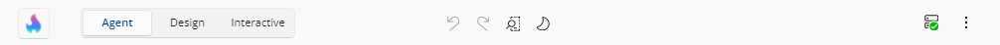
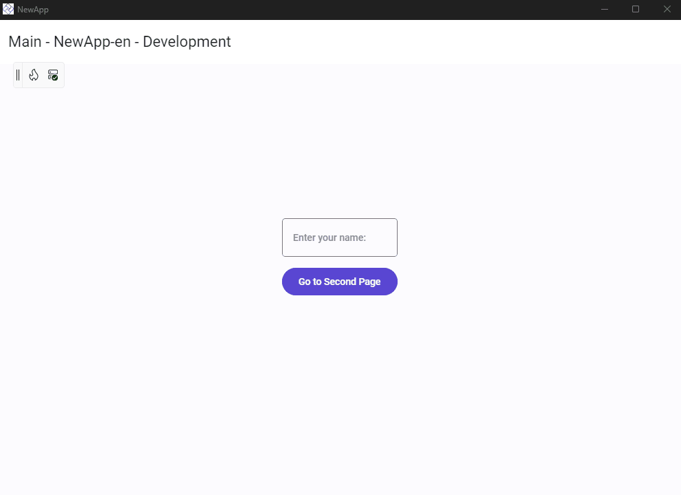
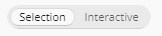
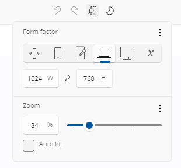
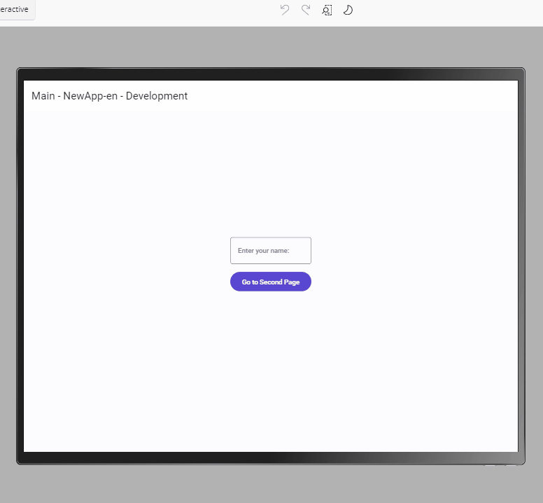
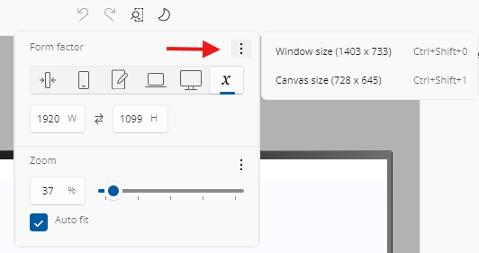
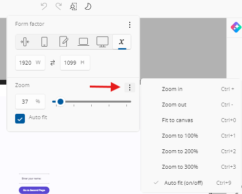

# Toolbar

The **Toolbar** gives you quick access to the most important tools while using Hot Design. Positioned at the top of the window by default, it lets you switch modes, test your running app, adjust layout settings, toggle themes, and manage your workspace efficiently, all without stopping your design flow.

  

Sections below explain each feature available from the **Toolbar** and how it helps during your UI design session.

## Move the Toolbar

By default, the **Toolbar** appears docked in the **top-left corner** of your running app window. It gives you quick access to Hot Design tools without interrupting your layout.

  

You can reposition the **Toolbar** to better fit your workflow:

- Click and hold the **side of the Toolbar** where the `||` icon appears.
- Drag it to the **top**, **bottom**, **left**, or **right** edges of the running app window.
- This helps keep design tools accessible while avoiding overlap with parts of your UI you want to focus on.

  

## Enter and Exit Hot Design

Click the flame icon in the **Toolbar** to toggle Hot Design mode.

-  **Enter**: Activates live editing and lets you interact with the app UI directly on the **Canvas**.
-  **Exit**: Returns to your running app view while keeping the app state intact.

The flame icon also tells you what state Hot Design is in before you enter it — see [Getting Started](xref:Uno.HotDesign.GetStarted.Guide#hot-design-status-on-the-entry-button) for what each badge means.

## Switch Between Selection and Interactive

A **Selection / Interactive** toggle decides what a click on the canvas does. Press `Ctrl + Shift + I` (`Cmd + Shift + I` on macOS) to flip it.

- **Selection** — clicking the canvas selects elements for editing.
- **Interactive** — pointer input passes through to your running app, so you can trigger navigation, test bindings, and validate animations without leaving Hot Design.

  

Toggling interactivity never changes what you were editing, so you can drive your app to the screen you care about and then carry straight on editing it.

Entering Interactive mode clears the current selection and closes any open nested editors first; leaving it rebuilds the element tree so the designer reflects wherever you navigated to. While Interactive is on, the **Toolbox**, **Elements**, and **Properties** panels are dimmed and inert — tapping one returns you to Selection mode.

> [!NOTE]
> The toggle is unavailable on the [Previews](xref:Uno.HotDesign.Previews) canvas, which has its own interaction handling. Turning it on while your page still carries design-time data asks you to confirm first.

## Undo and Redo Changes

Undo or redo changes made during your Hot Design session:

-  **Undo** (`Ctrl + Z`): Reverts the last edit (e.g., moved control, property change).
-  **Redo** (`Ctrl + Y` or `Ctrl + Shift + Z`): Reapplies an undone action.

Undo reverts both your running app and your XAML file. A continuous gesture — dragging to resize, or sliding a value — collapses into a single undo entry, and making a new change discards the redo entries. The history is per-session and is not carried over to the next one.

## Adjust Form Factor and Zoom Settings

Click the  **Form factor and Zoom** icon to open the form factor and zoom options.

  

  

The flyout has two sections — **Form Factor** and **Zoom** — and each is shown only where it applies. Both are available while designing your application. In [Previews](xref:Uno.HotDesign.Previews) mode, only what makes sense for what is on the canvas is offered.

### Form Factor

Preset options include:

- **Narrowest (IoT)** – Simulates ultra-compact embedded or IoT devices (149 × 298 px). Useful for validating minimal layouts with strict space constraints.
- **Narrow (Phone)** – Emulates a typical smartphone in portrait mode (390 × 844 px). Good for testing mobile responsiveness and touch-friendly controls.
- **Normal (Tablet)** – Represents a standard tablet (768 × 1024 px). Ideal for multi-column layouts, responsive grids, or medium-screen breakpoints.
- **Wide (Laptop)** – Mimics a desktop/laptop window in landscape orientation (1024 × 768 px). Use this to check menu bars, toolbars, and side navigation.
- **Widest (Desktop)** – Emulates a large screen or full desktop monitor (1920 × 1080 px). Perfect for dashboards, data-heavy views, or widescreen layouts.
- **User defined size (Custom)** – Enter any specific width and height manually. Great for prototyping non-standard screens or future devices.

Hovering a preset shows a tooltip with its name and dimensions. Selecting one resizes the design surface and centers the content; with **Auto-Fit** on, auto-fit remains the centering mechanism.

You can also:

- Type explicit **Width** and **Height** values. Dimensions matching a preset select that preset; otherwise **User defined size** is selected.
- Use the **swap** button to exchange width and height, rotating between portrait and landscape.
- Set the surface to the current **window size** or the visible **canvas size** from the overflow (⋮) menu.

Custom dimensions are remembered: switch to a preset and back to **User defined size** and your previous dimensions return — including dimensions produced by dragging a [resize gripper](xref:Uno.HotDesign.Canvas#resize-the-design-surface). Resizing your app window does not change the content dimensions or the saved custom size; only the zoom level adjusts, and only when Auto-Fit is on.

#### Keyboard Shortcuts

You can quickly toggle between sizing modes using the following shortcuts:

- **Match the window size**:

  `Ctrl + Shift + 0` (or `Cmd + Shift + 0` on macOS)
- **Match the canvas content area size**:

  `Ctrl + Shift + 1` (or `Cmd + Shift + 1` on macOS)
- **Cycle forward / backward through the presets** (skipping **User defined size**):

  `Ctrl + Shift + +` / `Ctrl + Shift + -` (or `Cmd + Shift + +` / `Cmd + Shift + -` on macOS)

  

### Zoom

Use the zoom controls to scale the **Canvas** view for better visibility. You can select a preset percentage, use the zoom slider, type a percentage, or apply shortcuts to quickly fit or magnify the layout area. Zoom is clamped to a range of **20% to 340%**, and the **Zoom in** / **Zoom out** commands step by 20 percentage points.

#### Keyboard Shortcuts

You can adjust zoom using the following shortcuts:

- **Zoom in**:

  `Ctrl + +` (or `Cmd + +` on macOS)
- **Zoom out**:

  `Ctrl + -` (or `Cmd + -` on macOS)
- **Fit the canvas to your window**:

  `Ctrl + 0` (or `Cmd + 0` on macOS)
- **Zoom to 100% / 200% / 300%**:

  `Ctrl + 1` / `2` / `3` (or `Cmd + 1` / `2` / `3` on macOS)
- **Toggle Auto-Fit**:

  `Ctrl + 9` (or `Cmd + 9` on macOS)
- Or **hold** `Ctrl` (or `Cmd` on macOS) and scroll with your mouse or trackpad

  

#### Auto-Fit

When **Auto-Fit** is enabled, the canvas scales to fit your window automatically and keeps the content centered. Setting a zoom value by any means turns Auto-Fit off.

### Settings Are Remembered Per Editing Context

Canvas size, zoom, Auto-Fit, and your remembered custom dimensions are saved **per editing context**. Set one size while designing your page and a different one inside a `UserControl` editor, and each shows its own settings when you switch to it. Those settings also survive closing and restarting your app.

Previews are the exception: their canvas size comes from their own XAML, so opening a preview neither reads nor writes a stored size.

## Switch Between Light and Dark Themes

Quickly preview your app in **Light** or **Dark** theme without changing your system or IDE settings. This helps ensure your UI adapts correctly to both themes, including text readability, background contrast, and resource behavior.

-  **Light Theme**: Uses light theme resources.
-  **Dark Theme**: Uses dark theme resources.

  

The toggle re-themes the **designed application** on the canvas, and the choice is part of the per-editor designer settings that are remembered between sessions.

## Check Connection and Hot Reload Status

The  connection icon shows whether the **Hot Reload** dev server is actively connected to your app (based on your [Uno Platform account sign-in](xref:Uno.GetStarted.Licensing)) and functioning correctly.

Click the icon to open the event logs overlay. It displays:

- Real-time connection updates  
- **Hot Reload** activity: successful reloads, errors, and warnings  
- Timestamps and additional context for each event

For details about Hot Reload status indicators and troubleshooting tips, see the [Hot Reload Indicator documentation](xref:Uno.Platform.Studio.HotReload.Overview#hot-reload-indicator).

> [!NOTE]
> If the dev server connection is lost while you are designing, Hot Design exits immediately and returns you to your running app. It becomes available again once the connection is restored.

## Access More Options

Click the  **More** icon to open the menu.

This menu includes two sections: **Windows** and **Help**.

### Windows

- **Show Tools In-App**:

  Choose whether the Toolbox, Elements, and Properties panels appear inside the running app window or in a separate external window.

  - When tools are shown **outside** the app (in an external window), **drag-and-drop interactions** from the Toolbox into the running app are not supported.

  - On **mobile platforms** (iOS and Android), tools are displayed **outside** the app by default due to limited canvas space on mobile devices.

  - [Previews](xref:Uno.HotDesign.Previews) mode is not available with external tooling — the canvas is switched back to **Application** mode when the external window opens.

You can also toggle the visibility of each tool panel individually:

- **All**: Show or hide all panels

  `Ctrl + Shift + A` (or `Cmd + Shift + A` on macOS)
- **Toolbox**: Toggle Toolbox panel visibility

  `Ctrl + Shift + T` (or `Cmd + Shift + T` on macOS)
- **Elements**: Toggle Elements visual tree panel visibility

  `Ctrl + Shift + E` (or `Cmd + Shift + E` on macOS)
- **Properties**: Toggle Properties panel visibility

  `Ctrl + Shift + P` (or `Cmd + Shift + P` on macOS)

**Shortcuts** opens the full [keyboard and mouse shortcut reference](xref:Uno.HotDesign.Shortcuts).

Which panels you had visible is remembered and restored the next time you enter Hot Design.

> [!NOTE]
> In the [external tool window](xref:Uno.HotDesign.ToolbarExternalWindow), the per-panel toggles are disabled — that window always shows its full set of panels.

### Help

Access **Hot Design** documentation (Overview, Getting Started, and the Counter App Tutorial), [submit feedback](xref:Uno.Platform.Studio.Feedback) (report an issue, suggest a feature, or ask a question), reach the community on Discord and YouTube, and find license and legal information — all in one place directly from Hot Design.

## Next step

- [Toolbox](xref:Uno.HotDesign.Toolbox)
