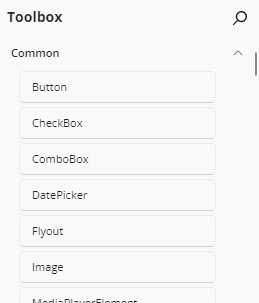
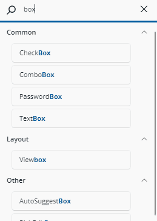
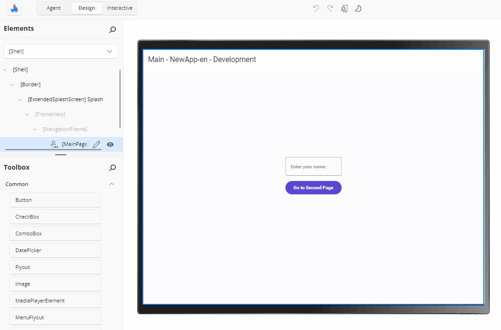
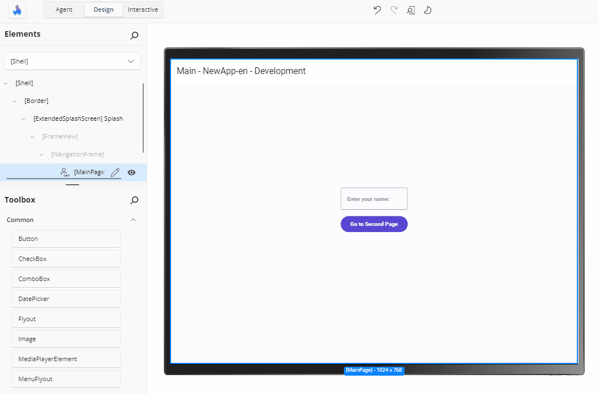

# Toolbox

The **Toolbox** panel lets you easily find and add controls and layout elements to build your app's UI. Located in the top-left corner of the Hot Design interface, it provides a searchable, categorized list of available controls that you can drag into the **Canvas** or the visual tree with the **Elements** panel.

Whether you're adding a button, creating a layout with a `Grid`, or inserting a custom control, the Toolbox helps you quickly locate and add what you need.

## Find the Right Control

At the top of the Toolbox, there's a search box. As you type, the list instantly updates to show matching controls and elements, together with their category headers, and the matched part of each name is highlighted. This helps you locate what you need without scrolling through the full list.

Search is forgiving about spaces — typing `text box` matches `TextBox`, and typing `textblock` matches `Text Block`. Matching a category name keeps the category and everything inside it visible, and collapsed categories and variant groups expand automatically so every match is reachable.

If nothing matches in the active tab, the list is replaced by a **No matching results found.** message inviting you to clear the input. Emptying the search box restores the full list with its previous structure.

## Browse Controls by Tab and Category

When the search box is empty, the Toolbox displays all available controls organized into collapsible categories across a tab bar. Click the arrow beside a category name to expand or collapse its contents.

### App

Selected by default, the **App** tab lists the controls that belong to your solution:

- A group **named after your application**, containing the public controls, `UserControl`s, and pages defined in your app project.
- A **Projects** group, with one sub-category per in-solution library that your app references by project reference.

Only types that Hot Design can actually create are listed: public, non-abstract, deriving from `UIElement`, and with a parameterless constructor. Previews and preview groups are never offered as controls — they are listed in the [Previews](xref:Uno.HotDesign.Previews) panel instead.

### System

The **System** tab lists everything that comes from outside your solution, under fixed category headers in this order:

- **Inputs** — `Button`, `TextBox`, `CheckBox`, `Slider`, and other controls the user interacts with
- **Collections** — data-bound controls such as `ListView`, `GridView`, and `ItemsRepeater`
- **Navigation** — navigation surfaces and their parts
- **Status & Feedback** — progress, info bars, and similar
- **Layout & Surfaces** — panels and containers such as `Grid`, `StackPanel`, and `Border`, used to structure the visual hierarchy of your XAML
- **Media & Icons** — images, media players, and icon elements
- **Text** — `TextBlock` and other text presentation controls
- **General** — everything built in that fits none of the above
- **Third Party** — controls from referenced packages, with one sub-category per library assembly

Each item is a text row showing the control name; hovering shows a tooltip with its full name.

> [!NOTE]
> A library or an individual control can opt out of the Toolbox, in which case it is not listed. Libraries that Hot Design itself depends on are excluded from **Third Party** unless your app references them explicitly.

### Snippets

The **Snippets** tab appears after **App** and **System** when snippets are enabled for your license. A snippet is a pre-composed, multi-element starting point rather than a single control — a sign-in form, a card, or a responsive page layout — grouped under snippet categories such as **Components**, **Navigation**, **Sections**, **Cards**, and **Page Layouts**.

Snippets depend on what your running application references: a snippet that needs an optional library (for example Uno Toolkit, Material theming, or reactive extensions) is omitted when your app does not reference it.

<!-- TODO(image): Screenshot of the Toolbox tab bar showing App, System, and Snippets tabs, with the Snippets tab open and its categories (Components, Navigation, Sections, Cards, Page Layouts) visible. -->

### Control Variants

A control that ships several variants — for example `Button` with **Default**, **Icon**, **Leading Icon**, and **FAB** — is shown as a single expandable row named after the control, collapsed by default, with the default variant listed first. Where only one variant is available in your application, the row is flattened to a plain item using the group name rather than a one-item group.

## Add a Control to the Canvas

To insert a control into your layout in the interactive **Canvas**:

1. Drag a control from the **Toolbox** panel.
2. Drop it onto the **Canvas**, inside the element where you want it to appear.

As the pointer enters the canvas, a live instance of the control — complete with its design-time sample content — is created as a drag preview and placed into the container under the pointer at the position it would land in. Dropping inserts the item's XAML into that container at that position, applies it to the running app, and writes it back to your XAML file as a single undoable change.

A few behaviours worth knowing:

- Dropping onto a `Canvas` records the drop coordinates as `Canvas.Left`/`Canvas.Top` attributes.
- An area that cannot accept another child — for example a single-child container that is already full — does not accept the drop.
- Dragging the item out of the canvas without dropping removes the preview and makes no change.
- Content dragged from outside Hot Design (for example text from another application) is ignored rather than treated as a toolbox item.

## Add a Control to the Visual Tree

To insert a control into the **Elements** panel:

1. Drag a control from the **Toolbox** panel.
2. Drop it into the desired parent node in the visual tree inside the **Elements** panel.

An insertion adorner shows where the element will land and the drag caption reads **Add \<item name>**:

- Dropping **on** a node that accepts children inserts the new element as a child.
- Dropping on the **top or bottom edge** of a node inserts before or after it, among its siblings.
- A node that cannot host children — a `TextBlock` in a `StackPanel`, say — forwards the drop to its parent as an insertion after that node.
- A property node only accepts items whose type the property supports.

## Insert a Control Using Double-Click

To quickly insert a control:

1. Select a parent element on the **Canvas** or in the visual tree in the **Elements** panel.
2. Double-click the wanted new control in the **Toolbox**. It will be added as a child of the previously selected element.

If nothing is selected, several elements are selected, or the selected element accepts no children, nothing is inserted and a warning explains why.

## Apply a Template to an Existing Element

Some toolbox items — layout presets and page layouts, for example — are meant to be **applied to an element you already have** rather than added as a new child. Drop one on (or double-click it with) an element whose type is compatible and its content and properties are applied to that element. Incompatible targets reject the operation.

Layout presets such as **Grid 2 x 2** or **StackPanel Horizontal** keep the target's existing children, and clear the layout properties the preset does not define — so a stale set of row or column definitions does not survive the change.

## Design-Time Sample Content

Many toolbox items carry design-time (`d:`) values so a newly dropped control is visible instead of blank — a `Button` arrives with its name as content, a list snippet renders sample items rather than an empty box.

Those values are shown in the drag preview and on the canvas, and are **excluded from the XAML written to your file**, so your source stays clean. The [Elements](xref:Uno.HotDesign.Elements) panel marks any element still carrying design-time values with a yellow dot so you can find them and replace them with real data.

## Availability

- The Toolbox is covered by a dimming overlay and its search, tabs, drag, and double-click interactions are inert while the designer is in a state that disables tool interaction — for example while **Interactive** mode is on.
- The catalog refreshes when your application reloads or Hot Reload loads new types, so a control you have just added to your project appears without restarting.
- The lists are cleared when the running application unloads, and rebuilt when the next one is ready.

> [!NOTE]
> When the tool panels are shown in the [external tool window](xref:Uno.HotDesign.ToolbarExternalWindow), dragging from the Toolbox into the running app is not supported. Use double-click insertion or drag onto the **Elements** tree instead.

## Next Step

- [Elements](xref:Uno.HotDesign.Elements)
